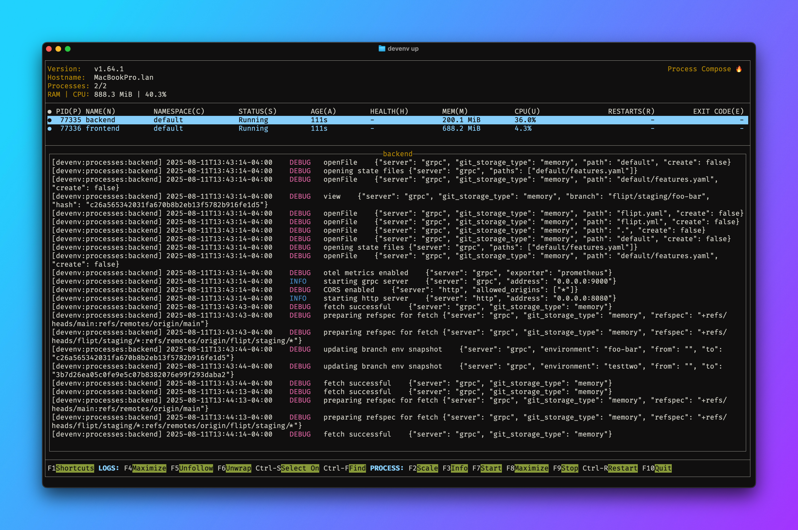

# Development

The following are instructions for setting up your local machine for Flipt development.

> [!TIP]
> Try our new [devenv](#devenv) solution to quickly get setup developing Flipt!

Also check out our [Contributing](CONTRIBUTING.md) guide for more information on how to get changes merged into the project.

## Requirements

Before starting, make sure you have the following installed:

- [GCC Compiler](https://gcc.gnu.org/install/binaries.html)
- [Go 1.24+](https://golang.org/doc/install)
- [NodeJS >= 22](https://nodejs.org/en/ )
- [Mage](https://magefile.org/)
- [Docker](https://docs.docker.com/install/) (for running unit tests)
- [Playwright](https://playwright.dev/docs/intro) (optional, for running UI tests)
- [Dagger](https://docs.dagger.io/install) (optional, for running integration tests)

## Setup

1. Clone this repo: `git clone https://github.com/flipt-io/flipt`.
1. Run `mage bootstrap` to install required development tools. See [#bootstrap](#bootstrap) below.
1. Run `mage go:test` to execute the Go test suite. For more information on tests, see also [here](build/README.md)
1. Run `mage` to build the binary with embedded assets.
1. Run `mage -l` to see a full list of possible commands.

## Conventional Commits

Flipt uses [Conventional Commits](https://www.conventionalcommits.org/en/v1.0.0/) for commit messages. This allows us to automatically generate changelogs and releases. To help with this, we use [pre-commit](https://pre-commit.com/) to automatically lint commit messages. To install pre-commit, run:

`pip install pre-commit` or `brew install pre-commit` (if you're on a Mac)

Then run `pre-commit install` to install the git hook.

## Bootstrap

The `bootstrap` task will install all of the necessary tools used for development and testing. It does this using a seperate tools modules as described here: [https://marcofranssen.nl/manage-go-tools-via-go-modules](https://marcofranssen.nl/manage-go-tools-via-go-modules)

## Configuration

A sample configuration for running and developing against Flipt can be found at `./config/local.yml`. To run Flipt with this configuration, run:

`./bin/flipt server [--config ./config/local.yml]`

To prevent providing the config via config flag every time, you have the option of writing configuration at the location:

```shell
{{ USER_CONFIG_DIR }}/flipt/config.yml
```

The flipt binary will check in that location if a `--config` override is not provided, so you can just invoke the binary:

`./bin/flipt server [--config ./config/local.yml]`

The `USER_CONFIG_DIR` is different based on your architecture, and specified [here](https://pkg.go.dev/os#UserConfigDir).

## Changes

Changing certain types of files such as the proto or ui files require re-building before they will be picked up in new versions of the binary.

### Updating .proto Files

After changing any proto files, you'll need to run `mage go:proto`. This will regenerate the necessary files in the `rpc` directory.

## Tests

To run the tests, you can use the `mage go:test` command. This will run the unit tests.

### Mocks

We use [mockery](https://github.com/vektra/mockery) to generate mocks for the tests. To regenerate mocks, you can use the `mage go:mockery` command.

## UI

The UI is built using [NPM](https://nodejs.org/en/) and [Vite](https://vitejs.dev/) and is also statically compiled into the Flipt binary using [go:embed](https://golang.org/pkg/embed/).

To develop the project with the UI also in development mode (with hot reloading):

1. Run `mage ui:dev` from the root of this repository. This will start a development server on port `5173` and proxy API requests to the Flipt API on port `8080`.
2. In another terminal, run `mage dev` (or `mage go:run`) from the root of this repository. This will run the backend server making it accessible on port `8080`.
3. Visit `http://localhost:8080` to see the UI.
4. Any changes made in the `ui` directory will be picked up by the development server and the UI will be reloaded.

### Ports

In development, the two ports that Flipt uses are:

- `8080`: The port for the Flipt REST API
- `9000`: The port for the Flipt GRPC Server

These ports will be forwarded to your local machine automatically if you are developing Flipt in a VSCode Remote Container or GitHub Codespace.

## Docker Compose

If you want to develop Flipt using Docker Compose, you can use the `docker-compose.yml` file in the root of this repository.

This will start two Docker containers:

- `server` will run the Flipt server, mounting the contents of this repository as a bind mount. This means that the database (SQLite by default) will be persisted between runs. Currently the server does not support hot reloading, so you'll need to restart the container to pick up any changes.
- `ui` will run the UI development server, mounting the `ui` directory as a bind mount. This means that any changes made to the UI will be picked up by the development server and the UI will be reloaded (thanks to Vite).

To start the containers, run `docker-compose up` from the root of this repository. After the containers are started, you can visit `http://localhost:8080` to see the UI.

## devenv

[devenv](https://devenv.sh) is a solution that creates fast, declarative, reproducible, and composable developer environments using Nix.

To use it for developing Flipt, you'll first need to install it. See the devenv [getting started](https://devenv.sh/getting-started/) guide for more information.

Once you have devenv installed, you can run `devenv up` from the root of this repository to start a development environment.

This will start a development environment with the Flipt server running on port `8080` and the UI development server running on port `5173`.


