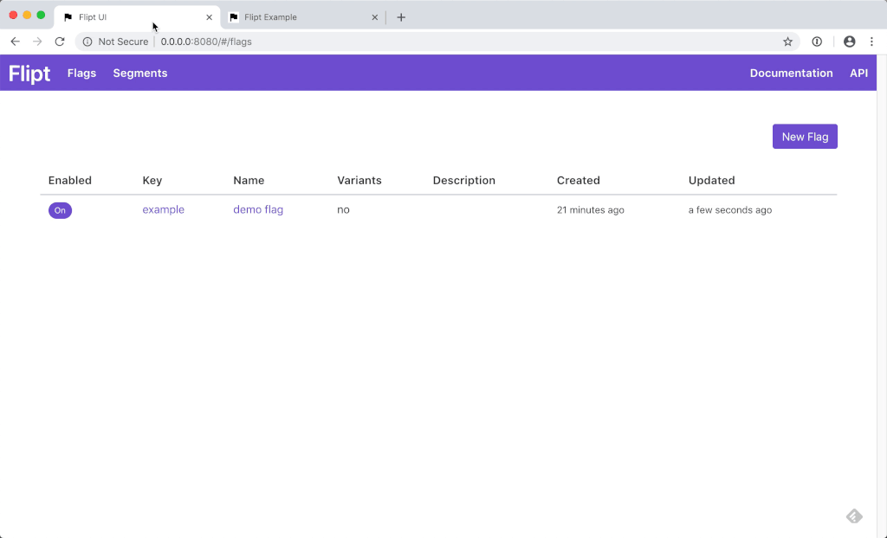

<p align=center>
    
</p>

<p align="center">An open source, self-hosted feature flag solution</p>

<hr />



<div align="center">
    <a href="https://github.com/flipt-io/flipt/releases">
        
    </a>
    <a href="https://github.com/flipt-io/flipt/actions">
        
    </a>
    <a href="https://github.com/flipt-io/flipt/blob/main/LICENSE">
        
    </a>
    <a href="https://hub.docker.com/r/markphelps/flipt">
        
    </a>
    <a href="https://codecov.io/gh/flipt-io/flipt">
        
    </a>
    <a href="https://goreportcard.com/report/github.com/flipt-io/flipt">
        
    </a>
    <a href="https://bestpractices.coreinfrastructure.org/projects/3498">
        
    </a>
    <a href="https://github.com/avelino/awesome-go">
        
    </a>
    <a href="https://discord.gg/fjPVc5JuyE">
        
    </a>
</div>

<div align="center">
    <h4>
        <a href="https://flipt.io/docs/getting_started/">Documentation</a> |
        <a href="#features">Features</a> |
        <a href="#values">Values</a> |
        <a href="#integration">Integration</a> |
        <a href="#community">Community</a> |
        <a href="#feedback">Feedback</a>
    </h4>
</div>

Flipt is an open source, self-hosted feature flag application that allows you to run experiments across services in **your** environment.

Flipt can be deployed within your existing infrastructure so that you don't have to worry about your information being sent to a third party or the latency required to communicate across the internet.

Flipt supports use cases such as:

- Simple on/off feature flags to toggle functionality in your applications
- Rolling out features to a percentage of your customers
- Using advanced segmentation to target and serve users based on custom properties that you define

## Features

- Fast. Written in Go. Optimized for performance
- Stand alone, easy to run and configure
- Ability to create advanced distribution rules to target segments of users
- Native [GRPC](https://grpc.io/) client SDKs to integrate with your existing applications easily
- Powerful REST API
- Modern, mobile friendly 📱 UI and debug console
- Support for multiple databases (Postgres, MySQL, SQLite)
- Data import and export to allow storing your data as code
- Cloud ready :cloud:. Runs anywhere: bare metal, PaaS, K8s, with Docker or without.

## Values

- :lock: **Security** - HTTPS support. No data leaves your servers and you don't have to open your systems to the outside world to communicate with Flipt. It all runs within your existing infrastructure.
- :rocket: **Speed** - Since Flipt is co-located with your existing services, you do not have to communicate across the internet which can add excessive latency and slow down your applications.
- :white_check_mark: **Simplicity** - Flipt is a single binary with no external dependencies by default.
- :thumbsup: **Compatibility** - REST, GRPC, MySQL, Postgres, SQLite, Redis.. Flipt supports it all.

## Works With

<p align="center">
    
    
    
    
    
</p>

## Try It

Try the latest version of Flipt out for yourself.

### Sandbox

[Try Flipt](https://try.flipt.io) in a deployed environment!

**Note:** The database gets cleared **every 30 minutes** in this sandbox environment!

### Docker


```bash
❯ docker run --rm -p 8080:8080 -p 9000:9000 -t flipt/flipt:latest
```

Flipt UI will now be reachable at [http://127.0.0.1:8080/](http://127.0.0.1:8080).

For more permanent methods of running Flipt, see the [Installation](https://flipt.io/docs/installation/) section.

## Logos

Some of the companies depending on Flipt in production.

<p>
    <a href="https://paradigm.co">
        
    </a>
    <a href="https://rokt.com">
        
    </a>
</p>

Using Flipt at your company? Open a PR and add your logo here!

## Integration

Checkout the [integration docs](https://flipt.io/docs/integration/) for more info on how to integrate Flipt into your existing application.

### REST API

Flipt is equipped with a fully functional REST API. In fact, the Flipt UI is completely backed by this same API. This means that anything that can be done in the Flipt UI can also be done via the REST API.

The [Flipt REST API](https://flipt.io/docs/api/) can also be used with any language that can make HTTP requests.

:exclamation: Offical generated REST clients coming soon.

### Official GRPC Client Libraries

- [Go](https://github.com/flipt-io/flipt-grpc-go)
- [Ruby](https://github.com/flipt-io/flipt-grpc-ruby)

:exclamation: Offical GRPC clients in other languages coming soon.

### Third-Party Client Libraries

Client libraries built by awesome people from the Open Source community:

| Library                                                             | Language   | Author                                                   | Desc                                                                                            |
| ------------------------------------------------------------------- | ---------- | -------------------------------------------------------- | ----------------------------------------------------------------------------------------------- |
| [flipt-grpc-python](https://github.com/getsentry/flipt-grpc-python) | Python     | [@getsentry](https://github.com/getsentry)               | Python GRPC bindings for Flipt                                                                  |
| [rflipt](https://github.com/christopherdiehl/rflipt)                | React      | [@christopherdiehl](https://github.com/christopherdiehl) | Components/example project to control React features backed by Flipt                            |
| [flipt-php](https://github.com/fetzi/flipt-php)                     | PHP        | [@fetzi](https://github.com/fetzi)                       | Package for evaluating feature flags via the Flipt REST API using [HTTPlug](http://httplug.io/) |
| [flipt-js](https://github.com/betrybe/flipt-js)                     | Javascript | [@betrybe](https://github.com/betrybe)                   | Flipt library for JS that allows rendering components based on Feature Flags 🎉                 |

### Generate Your Own

If a client in your language is not available for download, you can easily generate one yourself using the existing [protobuf definition](https://github.com/flipt-io/flipt/blob/main/rpc/flipt/flipt.proto). The [GRPC documentation](https://grpc.io/docs/) has extensive examples on how to generate GRPC clients in each supported language.

## Examples

Check out the [examples](/examples) to see how Flipt works.

Here's a [basic one](https://github.com/flipt-io/flipt/tree/main/examples/basic) to get started!

## Licensing

There are currently two types of licenses in place for Flipt:

1. Client License
2. Server License

### Client License

All of the code required to generate GRPC clients in other languages as well as the existing GRPC Go client are licensed under the [MIT License](https://spdx.org/licenses/MIT.html).

This code exists in the [rpc/](rpc/) directory.

The client code is the code that you would integrate into your applications, which is why a more permissive license is used.

### Server License

The server code is licensed under the [GPL 3.0 License](https://spdx.org/licenses/GPL-3.0.html).

See [LICENSE](LICENSE).

## Sponsors

If you use Flipt at your company, please consider [becoming a sponsor](https://github.com/sponsors/markphelps) today.

## Enterprise

Need more features or support using Flipt within your Enterprise?

Please help me prioritize an Enterprise version of Flipt by filling out this [short survey](https://forms.gle/a4UBnv8LADYirA4c9)!

## Community

For help and discussion around Flipt, feature flag best practices, and more, join us on [Discord](https://discord.gg/fjPVc5JuyE).

## Feedback

If you are a user of Flipt I'd really :heart: it if you could leave a testimonal on how Flipt is working for you.

https://testimonial.to/flipt

## Author

| [](https://twitter.com/intent/user?screen_name=mark_a_phelps "Follow @mark_a_phelps on Twitter") |
| --------------------------------------------------------------------------------------------------------------------------------------------------------------------------------------------- |
| [Mark Phelps](https://markphelps.me/)                                                                                                                                                         |

## Contributing

I would love your help! Before submitting a PR, please read over the [Contributing](.github/contributing.md) guide.

No contribution is too small, whether it be bug reports/fixes, feature requests, documentation updates, or anything else that can help drive the project forward.

## Contributors ✨

Thanks goes to these wonderful people ([emoji key](https://allcontributors.org/docs/en/emoji-key)):

<!-- ALL-CONTRIBUTORS-LIST:START - Do not remove or modify this section -->
<!-- prettier-ignore-start -->
<!-- markdownlint-disable -->
<table>
  <tr>
    <td align="center"><a href="http://aaronraff.github.io"><br /><sub><b>Aaron Raff</b></sub></a><br /><a href="https://github.com/flipt-io/flipt/commits?author=aaronraff" title="Code">💻</a></td>
    <td align="center"><a href="http://twitter.com/rochacon"><br /><sub><b>Rodrigo Chacon</b></sub></a><br /><a href="https://github.com/flipt-io/flipt/commits?author=rochacon" title="Code">💻</a></td>
    <td align="center"><a href="http://christopherdiehl.github.io"><br /><sub><b>Christopher Diehl</b></sub></a><br /><a href="https://github.com/flipt-io/flipt/commits?author=christopherdiehl" title="Code">💻</a></td>
    <td align="center"><a href="https://www.andrewzallen.com"><br /><sub><b>Andrew Z Allen</b></sub></a><br /><a href="https://github.com/flipt-io/flipt/commits?author=achew22" title="Documentation">📖</a></td>
    <td align="center"><a href="http://sf.khepin.com"><br /><sub><b>Sebastien Armand</b></sub></a><br /><a href="https://github.com/flipt-io/flipt/commits?author=khepin" title="Code">💻</a></td>
    <td align="center"><a href="https://github.com/badboyd"><br /><sub><b>Dat Tran</b></sub></a><br /><a href="https://github.com/flipt-io/flipt/commits?author=badboyd" title="Code">💻</a></td>
    <td align="center"><a href="http://twitter.com/jon_perl"><br /><sub><b>Jon Perl</b></sub></a><br /><a href="https://github.com/flipt-io/flipt/commits?author=jperl" title="Tests">⚠️</a> <a href="https://github.com/flipt-io/flipt/commits?author=jperl" title="Code">💻</a></td>
  </tr>
  <tr>
    <td align="center"><a href="https://or-e.net"><br /><sub><b>Or Elimelech</b></sub></a><br /><a href="https://github.com/flipt-io/flipt/commits?author=vic3lord" title="Code">💻</a></td>
    <td align="center"><a href="https://github.com/giddel"><br /><sub><b>giddel</b></sub></a><br /><a href="https://github.com/flipt-io/flipt/commits?author=giddel" title="Code">💻</a></td>
    <td align="center"><a href="http://eduar.do"><br /><sub><b>Eduardo</b></sub></a><br /><a href="https://github.com/flipt-io/flipt/commits?author=edumucelli" title="Documentation">📖</a> <a href="https://github.com/flipt-io/flipt/commits?author=edumucelli" title="Code">💻</a></td>
    <td align="center"><a href="https://github.com/itaischwartz"><br /><sub><b>Itai Schwartz</b></sub></a><br /><a href="https://github.com/flipt-io/flipt/commits?author=itaischwartz" title="Code">💻</a></td>
    <td align="center"><a href="https://bandism.net/"><br /><sub><b>Ikko Ashimine</b></sub></a><br /><a href="https://github.com/flipt-io/flipt/commits?author=eltociear" title="Documentation">📖</a></td>
    <td align="center"><a href="https://sagikazarmark.hu"><br /><sub><b>Márk Sági-Kazár</b></sub></a><br /><a href="https://github.com/flipt-io/flipt/commits?author=sagikazarmark" title="Code">💻</a></td>
    <td align="center"><a href="https://github.com/pietdaniel"><br /><sub><b>Dan Piet</b></sub></a><br /><a href="https://github.com/flipt-io/flipt/commits?author=pietdaniel" title="Code">💻</a></td>
  </tr>
  <tr>
    <td align="center"><a href="https://github.com/amayvs"><br /><sub><b>Amay Shah</b></sub></a><br /><a href="https://github.com/flipt-io/flipt/commits?author=amayvs" title="Code">💻</a></td>
    <td align="center"><a href="https://github.com/kevin-ip"><br /><sub><b>kevin-ip</b></sub></a><br /><a href="https://github.com/flipt-io/flipt/commits?author=kevin-ip" title="Code">💻</a></td>
    <td align="center"><a href="https://github.com/albertchae"><br /><sub><b>albertchae</b></sub></a><br /><a href="https://github.com/flipt-io/flipt/commits?author=albertchae" title="Code">💻</a></td>
  </tr>
</table>

<!-- markdownlint-restore -->
<!-- prettier-ignore-end -->

<!-- ALL-CONTRIBUTORS-LIST:END -->

This project follows the [all-contributors](https://github.com/all-contributors/all-contributors) specification. Contributions of any kind welcome!
