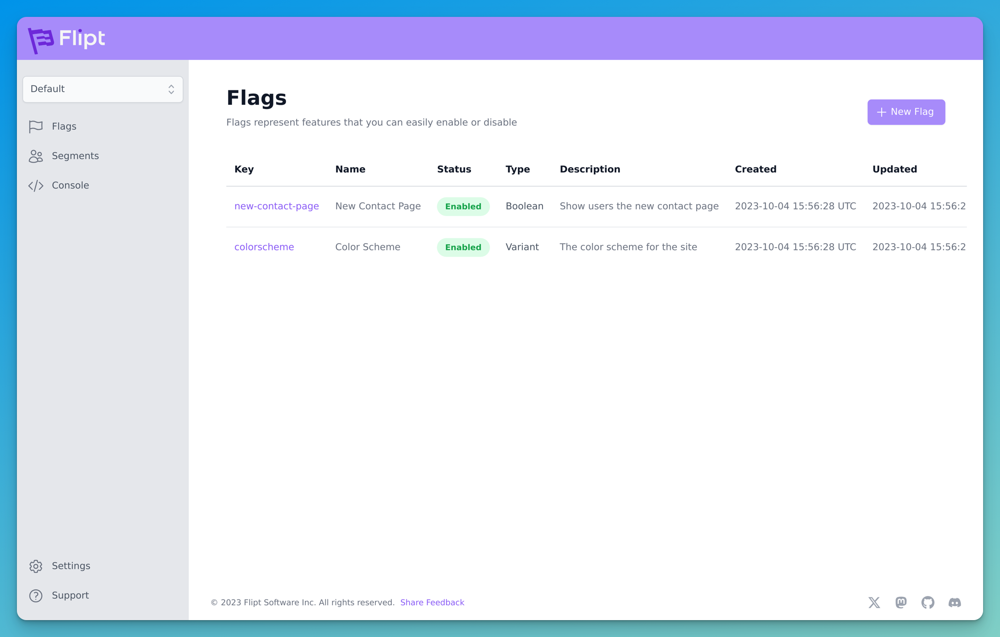
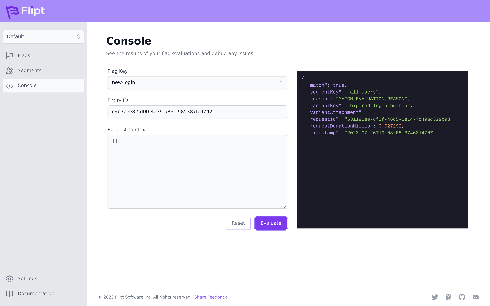
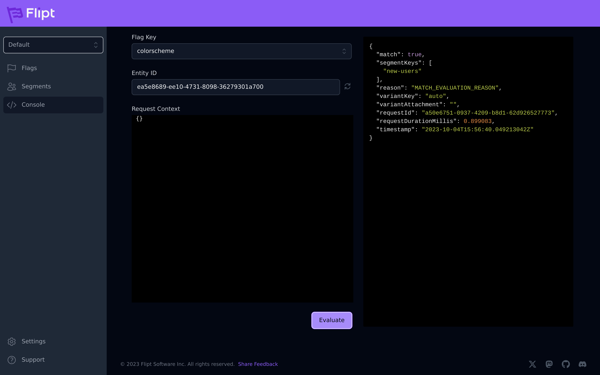
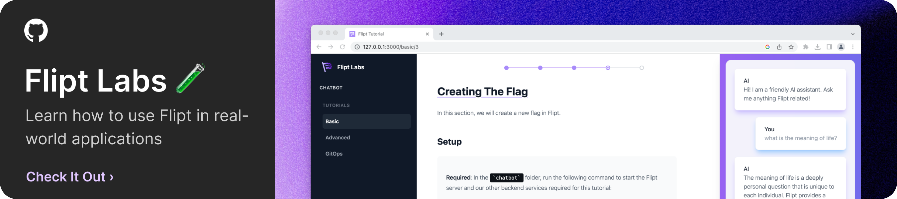

<p align=center>
    
</p>

<p align="center">An open source, self-hosted feature flag solution</p>

<hr />

<p align="center">
    
</p>

<div align="center">
    <a href="https://github.com/flipt-io/flipt/releases">
        
    </a>
    <a href="https://github.com/flipt-io/flipt/actions">
        
    </a>
    <a href="https://github.com/flipt-io/flipt/blob/main/LICENSE">
        
    </a>
    <a href="https://codecov.io/gh/flipt-io/flipt">
        
    </a>
    <a href="https://goreportcard.com/report/github.com/flipt-io/flipt">
        
    </a>
    <a href="https://bestpractices.coreinfrastructure.org/projects/3498">
        
    </a>
    <a href="https://github.com/avelino/awesome-go">
        
    </a>
    <a href="https://magefile.org">
        
    </a>
    <a href="https://discord.gg/kRhEqG2TEZ">
        
    </a>
    <a href="https://features.flipt.io/roadmap">
        
    </a>
</div>

<div align="center">
    <h4>
        <a href="https://www.flipt.io/docs/introduction">Docs</a> •
        <a href="http://www.flipt.io">Website</a> •
        <a href="http://www.flipt.io/blog">Blog</a> •
        <a href="https://features.flipt.io/">Feedback</a> •
        <a href="https://www.flipt.io/discord">Discord</a>
    </h4>
</div>

[Flipt](https://www.flipt.io) is an open-source, self-hosted feature flag application that allows you to run experiments across services in **your** environment.

Flipt can be deployed within your existing infrastructure so that you don't have to worry about your information being sent to a third party or the latency required to communicate across the internet.

<br clear="both"/>

<p align="center">
    <a href="https://console.dev/tools/flipt" title="Visit Console - the best tools for developers"></a>
</p>

## Usecases

Flipt supports use cases such as:

- Enabling [trunk-based development](https://trunkbaseddevelopment.com/) workflows
- Testing new features internally during development before releasing them fully in production
- Ensuring overall system safety by guarding new releases with an emergency kill switch
- Gating certain features for different permission levels allowing you to control who sees what
- Enabling continuous configuration by changing values during runtime without additional deployments

<br clear="both"/>

## Features

- Fast. Written in Go. Optimized for performance
- Stand alone, single binary that's easy to run and [configure](https://www.flipt.io/docs/configuration/overview)
- Ability to create advanced distribution rules to target segments of users
- Native [GRPC](https://grpc.io/) client [SDKs](#grpc-client-libraries) to integrate with your existing GRPC architecture
- Powerful REST API with native [SDKs](#rest-client-libraries) for easy integration
- Modern, mobile-friendly 📱 UI and debug console with dark mode 🌙
- Supports multiple databases: Postgres, MySQL, SQLite, [libSQL](https://turso.tech/libsql), and [CockroachDB](https://github.com/cockroachdb/cockroach)
- Import and export to allow storing your data as code
- Cloud-ready. Runs anywhere: bare metal, PaaS, K8s, with Docker or without
- Works with [Prometheus](https://prometheus.io/) and [OpenTelemetry](https://opentelemetry.io/) out of the box 🔋
- [Filesystem, S3, and Git storage backends](https://www.flipt.io/docs/configuration/storage#filesystem) to support GitOps workflows
- Audit logging with webhooks support to track changes to your data

Are we missing a feature that you'd like to see? [Let us know!](https://features.flipt.io)

<br clear="both"/>

<div align="center">


</div>

<br clear="both"/>

## Values

- :lock: **Security** - HTTPS support. [OIDC](https://www.flipt.io/docs/authentication/methods#openid-connect) and [Static Token](https://www.flipt.io/docs/authentication/methods#static-token) authentication. [Auditing](https://www.flipt.io/docs/configuration/auditing). No data leaves your servers and you don't have to open your systems to the outside world to communicate with Flipt. It all runs within your existing infrastructure.
- :rocket: **Speed** - Since Flipt is co-located with your existing services, you do not have to communicate across the internet which can add excessive latency and slow down your applications.
- :white_check_mark: **Simplicity** - Flipt is a single binary with no external dependencies by default.
- :thumbsup: **Compatibility** - REST, GRPC, MySQL, Postgres, CockroachDB, SQLite, LibSQL, Redis... Flipt supports it all.
- :eyes: **Observability** - Flipt integrates with [Prometheus](https://prometheus.io/) and [OpenTelemetry](https://opentelemetry.io/) to provide metrics and tracing. We support sending trace data to [Jaeger](https://www.jaegertracing.io/), [Zipkin](https://zipkin.io/), and [OpenTelemetry Protocol (OTLP)](https://opentelemetry.io/docs/reference/specification/protocol/) backends.

<br clear="both"/>

## Works With

<p align="center">
    
    
    
    
    
</p>
<p align="center">
    
    
    
    
    
</p>

## Try It

Try the latest version of Flipt for yourself.

### Deploy 

[](https://render.com/deploy)

### Sandbox

[Try Flipt](https://try.flipt.io) in a deployed environment!

**Note:** The database gets cleared **every 30 minutes** in this sandbox environment!

### Homebrew :beer:

```bash
brew install flipt-io/brew/flipt
brew services start flipt

# or run in the foreground
flipt
```

Flipt UI will now be reachable at [http://127.0.0.1:8080/](http://127.0.0.1:8080).

### Docker :whale:

```bash
docker run --rm -p 8080:8080 -p 9000:9000 -t docker.flipt.io/flipt/flipt:latest
```

Flipt UI will now be reachable at [http://127.0.0.1:8080/](http://127.0.0.1:8080).

For more permanent methods of running Flipt, see the [Installation](https://flipt.io/docs/installation/) section.

### Nightly Build

Like to live on the edge? Can't wait for the next release? Our nightly builds include the latest changes on `main` and are built.. well.. nightly.

```bash
docker run --rm -p 8080:8080 -p 9000:9000 -t docker.flipt.io/flipt/flipt:nightly
```

<br clear="both"/>

## Release Cadence

Flipt follows [semantic versioning](https://semver.org/) for versioning.

We aim to release a new minor version of Flipt every 2-3 weeks. This allows us to quickly iterate on new features.
Bug fixes and security patches (patch versions) will be released as needed.

<br clear="both"/>

## Integration

Check out the [integration documentation](https://flipt.io/docs/integration/) for more info on how to integrate Flipt into your existing applications.

<br clear="both"/>

<p align="center">
    <a href="https://github.com/flipt-io/labs"></a>
</p>

<br clear="both"/>

### REST API

Flipt is equipped with a fully functional REST API. In fact, the Flipt UI is completely backed by this same API. This means that anything that can be done in the Flipt UI can also be done via the REST API.

The [Flipt REST API](https://www.flipt.io/docs/reference/overview) can also be used with any language that can make HTTP requests.

### REST Client Libraries

| Language | Version | Status |
| -------- | ------- | ------ |
| [Go](./sdk/go) |  |  |
| [Node/TypeScript](https://github.com/flipt-io/flipt-node) | [](https://www.npmjs.com/package/@flipt-io/flipt) |  |
| [Java](https://github.com/flipt-io/flipt-java) | [](https://central.sonatype.com/artifact/io.flipt/flipt-java) |  |
| [Python](https://github.com/flipt-io/flipt-python) | [](https://pypi.org/project/flipt) |  |
| [Rust](https://github.com/flipt-io/flipt-rust) | [](https://crates.io/crates/flipt) |  |
| [PHP](https://github.com/flipt-io/flipt-php) | [](https://packagist.org/packages/flipt-io/flipt) |  |

### GRPC Client Libraries

| Language | Version | Status |
| -------- | ------- | ------ |
| [Go](./sdk/go) |  |  |
| [Ruby](https://github.com/flipt-io/flipt-grpc-ruby) |  |  |
| [.NET](https://github.com/flipt-io/flipt-grpc-dotnet) |  |  |

### Generate Your Own

If a client in your language is not available for download, you can easily generate one yourself using the existing [protobuf definition](https://github.com/flipt-io/flipt/blob/main/rpc/flipt/flipt.proto).

Our [integration documentation](https://www.flipt.io/docs/integration) has more information on how to generate your own Flipt clients in your language of choice.

<br clear="both"/>

## Development

[Development](DEVELOPMENT.md) documentation is available for those interested in contributing to Flipt.

We welcome contributions of any kind, including but not limited to bug fixes, feature requests, documentation improvements, and more. Just open an issue or pull request and we'll be happy to help out!

<br clear="both"/>

[](https://github.com/codespaces/new/?repo=flipt-io/flipt)

<br clear="both"/>

## Examples

Check out the [examples](/examples) to see how Flipt works in different use cases.

<br clear="both"/>

## Licensing

There are currently two types of licenses in place for Flipt:

1. Client License
2. Server License

### Client License

All of the code required to generate GRPC clients in other languages as well as the [Go SDK](/sdk/go) are licensed under the [MIT License](https://spdx.org/licenses/MIT.html).

This code exists in the [rpc/](rpc/) directory.

The client code is the code that you would integrate into your applications, which is why a more permissive license is used.

### Server License

The server code is licensed under the [GPL 3.0 License](https://spdx.org/licenses/GPL-3.0.html).

See [LICENSE](LICENSE).

<br clear="both"/>

## Logos

Some of the organizations depending on Flipt in production.

<p align="center">
    <a href="https://paradigm.co">
        
    </a>&nbsp;&nbsp;
    <a href="https://rokt.com">
        
    </a>&nbsp;&nbsp;
    <a href="https://asphaltbot.com">
        
    </a>&nbsp;&nbsp;
    <a href="https://prose.com">
        
    </a>&nbsp;&nbsp;
    <a href="https://www.gov.uk/government/organisations/ministry-of-justice">
        
    </a>&nbsp;&nbsp;
    <a href="https://www.ocrolus.com">
        
    </a>
</p>

Using Flipt at your company? Open a [PR](https://github.com/flipt-io/flipt/pulls) and add your logo here!

<br clear="both"/>

## Community

For help and discussion around Flipt, feature flag best practices, and more, join us on [Discord](https://www.flipt.io/discord).

<br clear="both"/>

## Contributing

We would love your help! Before submitting a PR, please read over the [Contributing](.github/contributing.md) guide.

No contribution is too small, whether it be bug reports/fixes, feature requests, documentation updates, or anything else that can help drive the project forward.

Check out our [public roadmap](https://volta.net/embed/eyJzdGF0dXNlcyI6WyJ0cmlhZ2UiLCJiYWNrbG9nIiwidG9kbyIsImluX3Byb2dyZXNzIiwiaW5fcmV2aWV3IiwiZG9uZSIsInJlbGVhc2VkIiwiY2FuY2VsbGVkIl0sImZpbHRlcnMiOnt9LCJvd25lciI6ImZsaXB0LWlvIiwibmFtZSI6ImZsaXB0In0=) to see what we're working on and where you can help.

<br clear="both"/>

## Contributors ✨

Thanks goes to these wonderful people ([emoji key](https://allcontributors.org/docs/en/emoji-key)):

<!-- ALL-CONTRIBUTORS-LIST:START - Do not remove or modify this section -->
<!-- prettier-ignore-start -->
<!-- markdownlint-disable -->
<table>
  <tbody>
    <tr>
      <td align="center" valign="top" width="14.28%"><a href="http://aaronraff.github.io"><br /><sub><b>Aaron Raff</b></sub></a><br /><a href="https://github.com/flipt-io/flipt/commits?author=aaronraff" title="Code">💻</a></td>
      <td align="center" valign="top" width="14.28%"><a href="http://twitter.com/rochacon"><br /><sub><b>Rodrigo Chacon</b></sub></a><br /><a href="https://github.com/flipt-io/flipt/commits?author=rochacon" title="Code">💻</a></td>
      <td align="center" valign="top" width="14.28%"><a href="http://christopherdiehl.github.io"><br /><sub><b>Christopher Diehl</b></sub></a><br /><a href="https://github.com/flipt-io/flipt/commits?author=christopherdiehl" title="Code">💻</a></td>
      <td align="center" valign="top" width="14.28%"><a href="https://www.andrewzallen.com"><br /><sub><b>Andrew Z Allen</b></sub></a><br /><a href="https://github.com/flipt-io/flipt/commits?author=achew22" title="Documentation">📖</a></td>
      <td align="center" valign="top" width="14.28%"><a href="http://sf.khepin.com"><br /><sub><b>Sebastien Armand</b></sub></a><br /><a href="https://github.com/flipt-io/flipt/commits?author=khepin" title="Code">💻</a></td>
      <td align="center" valign="top" width="14.28%"><a href="https://github.com/badboyd"><br /><sub><b>Dat Tran</b></sub></a><br /><a href="https://github.com/flipt-io/flipt/commits?author=badboyd" title="Code">💻</a></td>
      <td align="center" valign="top" width="14.28%"><a href="http://twitter.com/jon_perl"><br /><sub><b>Jon Perl</b></sub></a><br /><a href="https://github.com/flipt-io/flipt/commits?author=jperl" title="Tests">⚠️</a> <a href="https://github.com/flipt-io/flipt/commits?author=jperl" title="Code">💻</a></td>
    </tr>
    <tr>
      <td align="center" valign="top" width="14.28%"><a href="https://or-e.net"><br /><sub><b>Or Elimelech</b></sub></a><br /><a href="https://github.com/flipt-io/flipt/commits?author=vic3lord" title="Code">💻</a></td>
      <td align="center" valign="top" width="14.28%"><a href="https://github.com/giddel"><br /><sub><b>giddel</b></sub></a><br /><a href="https://github.com/flipt-io/flipt/commits?author=giddel" title="Code">💻</a></td>
      <td align="center" valign="top" width="14.28%"><a href="http://eduar.do"><br /><sub><b>Eduardo</b></sub></a><br /><a href="https://github.com/flipt-io/flipt/commits?author=edumucelli" title="Documentation">📖</a> <a href="https://github.com/flipt-io/flipt/commits?author=edumucelli" title="Code">💻</a></td>
      <td align="center" valign="top" width="14.28%"><a href="https://github.com/itaischwartz"><br /><sub><b>Itai Schwartz</b></sub></a><br /><a href="https://github.com/flipt-io/flipt/commits?author=itaischwartz" title="Code">💻</a></td>
      <td align="center" valign="top" width="14.28%"><a href="https://bandism.net/"><br /><sub><b>Ikko Ashimine</b></sub></a><br /><a href="https://github.com/flipt-io/flipt/commits?author=eltociear" title="Documentation">📖</a></td>
      <td align="center" valign="top" width="14.28%"><a href="https://sagikazarmark.hu"><br /><sub><b>Márk Sági-Kazár</b></sub></a><br /><a href="https://github.com/flipt-io/flipt/commits?author=sagikazarmark" title="Code">💻</a></td>
      <td align="center" valign="top" width="14.28%"><a href="https://github.com/pietdaniel"><br /><sub><b>Dan Piet</b></sub></a><br /><a href="https://github.com/flipt-io/flipt/commits?author=pietdaniel" title="Code">💻</a></td>
    </tr>
    <tr>
      <td align="center" valign="top" width="14.28%"><a href="https://github.com/amayvs"><br /><sub><b>Amay Shah</b></sub></a><br /><a href="https://github.com/flipt-io/flipt/commits?author=amayvs" title="Code">💻</a></td>
      <td align="center" valign="top" width="14.28%"><a href="https://github.com/kevin-ip"><br /><sub><b>kevin-ip</b></sub></a><br /><a href="https://github.com/flipt-io/flipt/commits?author=kevin-ip" title="Code">💻</a></td>
      <td align="center" valign="top" width="14.28%"><a href="https://github.com/albertchae"><br /><sub><b>albertchae</b></sub></a><br /><a href="https://github.com/flipt-io/flipt/commits?author=albertchae" title="Code">💻</a></td>
      <td align="center" valign="top" width="14.28%"><a href="http://thomas.sickert.dev"><br /><sub><b>Thomas Sickert</b></sub></a><br /><a href="https://github.com/flipt-io/flipt/commits?author=tsickert" title="Documentation">📖</a></td>
      <td align="center" valign="top" width="14.28%"><a href="https://github.com/jalaziz"><br /><sub><b>Jameel Al-Aziz</b></sub></a><br /><a href="#platform-jalaziz" title="Packaging/porting to new platform">📦</a></td>
      <td align="center" valign="top" width="14.28%"><a href="https://george.macro.re"><br /><sub><b>George</b></sub></a><br /><a href="https://github.com/flipt-io/flipt/commits?author=GeorgeMac" title="Code">💻</a></td>
      <td align="center" valign="top" width="14.28%"><a href="https://syntaqx.com"><br /><sub><b>Chase Pierce</b></sub></a><br /><a href="https://github.com/flipt-io/flipt/commits?author=syntaqx" title="Code">💻</a></td>
    </tr>
    <tr>
      <td align="center" valign="top" width="14.28%"><a href="http://showwin.asia"><br /><sub><b>ITO Shogo</b></sub></a><br /><a href="https://github.com/flipt-io/flipt/commits?author=showwin" title="Tests">⚠️</a></td>
      <td align="center" valign="top" width="14.28%"><a href="https://github.com/yquansah"><br /><sub><b>Yoofi Quansah</b></sub></a><br /><a href="https://github.com/flipt-io/flipt/commits?author=yquansah" title="Code">💻</a></td>
      <td align="center" valign="top" width="14.28%"><a href="https://github.com/darinmclain"><br /><sub><b>Darin McLain</b></sub></a><br /><a href="https://github.com/flipt-io/flipt/commits?author=darinmclain" title="Code">💻</a></td>
      <td align="center" valign="top" width="14.28%"><a href="https://www.adamweiss.me"><br /><sub><b>Adam Weiss</b></sub></a><br /><a href="#example-amweiss" title="Examples">💡</a></td>
      <td align="center" valign="top" width="14.28%"><a href="https://github.com/yuvalg99"><br /><sub><b>Yuval Goihberg</b></sub></a><br /><a href="#design-yuvalg99" title="Design">🎨</a></td>
      <td align="center" valign="top" width="14.28%"><a href="https://v0x.nl"><br /><sub><b>David Stotijn</b></sub></a><br /><a href="https://github.com/flipt-io/flipt/commits?author=dstotijn" title="Code">💻</a></td>
      <td align="center" valign="top" width="14.28%"><a href="https://github.com/MattNotarangelo"><br /><sub><b>Matthew Notarangelo</b></sub></a><br /><a href="https://github.com/flipt-io/flipt/commits?author=MattNotarangelo" title="Code">💻</a></td>
    </tr>
    <tr>
      <td align="center" valign="top" width="14.28%"><a href="https://www.linkedin.com/in/charles-oconor-77187455/"><br /><sub><b>Charles OConor</b></sub></a><br /><a href="https://github.com/flipt-io/flipt/commits?author=charlesoconor" title="Documentation">📖</a></td>
      <td align="center" valign="top" width="14.28%"><a href="https://github.com/ahobson"><br /><sub><b>Andrew Hobson</b></sub></a><br /><a href="https://github.com/flipt-io/flipt/commits?author=ahobson" title="Code">💻</a></td>
      <td align="center" valign="top" width="14.28%"><a href="https://github.com/rudineirk"><br /><sub><b>Rudinei Goi Roecker</b></sub></a><br /><a href="https://github.com/flipt-io/flipt/commits?author=rudineirk" title="Code">💻</a></td>
      <td align="center" valign="top" width="14.28%"><a href="https://github.com/testwill"><br /><sub><b>guangwu</b></sub></a><br /><a href="https://github.com/flipt-io/flipt/commits?author=testwill" title="Code">💻</a></td>
      <td align="center" valign="top" width="14.28%"><a href="https://github.com/Provinite"><br /><sub><b>Collin Driscoll</b></sub></a><br /><a href="https://github.com/flipt-io/flipt/commits?author=Provinite" title="Code">💻</a></td>
      <td align="center" valign="top" width="14.28%"><a href="https://github.com/Jamess-Lucass"><br /><sub><b>James</b></sub></a><br /><a href="https://github.com/flipt-io/flipt/commits?author=Jamess-Lucass" title="Code">💻</a></td>
      <td align="center" valign="top" width="14.28%"><a href="https://github.com/legoheld"><br /><sub><b>legoheld</b></sub></a><br /><a href="https://github.com/flipt-io/flipt/commits?author=legoheld" title="Code">💻</a></td>
    </tr>
  </tbody>
</table>

<!-- markdownlint-restore -->
<!-- prettier-ignore-end -->

<!-- ALL-CONTRIBUTORS-LIST:END -->

This project follows the [all-contributors](https://github.com/all-contributors/all-contributors) specification. Contributions of any kind welcome!
