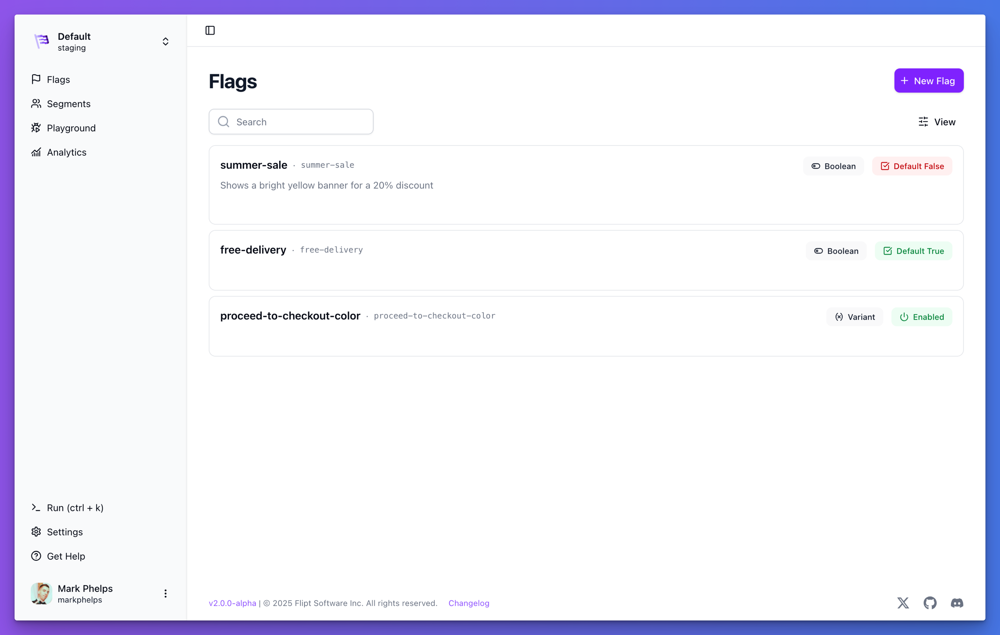

<p align=center>
    
</p>

<p align="center">An enterprise-ready, GRPC powered, GitOps enabled, CloudNative, feature management solution</p>

<hr />

<p align="center">
    
</p>

<br clear="both"/>

<div align="center">
    <a href="https://github.com/flipt-io/flipt/releases">
        
    </a>
    <a href="https://github.com/flipt-io/flipt/blob/main/LICENSE">
        
    </a>
    <a href="https://codecov.io/gh/flipt-io/flipt">
        
    </a>
    <a href="https://goreportcard.com/report/github.com/flipt-io/flipt">
        
    </a>
    <a href="https://github.com/avelino/awesome-go">
        
    </a>
    <a href="https://flipt.io/discord">
        
    </a>
    <a href="https://github.com/orgs/flipt-io/projects/4">
        
    </a>
    <a href="https://twitter.com/flipt_io">
        
    </a>
</div>

<div align="center">
    <h4>
        <a href="https://www.flipt.io/docs/introduction">Docs</a> •
        <a href="http://www.flipt.io">Website</a> •
        <a href="http://www.flipt.io/blog">Blog</a> •
        <a href="https://features.flipt.io/">Feedback</a> •
        <a href="#contributing">Contributing</a> •
        <a href="https://www.flipt.io/discord">Discord</a>
    </h4>
</div>

[Flipt](https://www.flipt.io) enables you to follow DevOps best practices and separate releases from deployments. Built with high-performance engineering organizations in mind.

Flipt can be deployed within your existing infrastructure so that you don't have to worry about your information being sent to a third party or the latency required to communicate across the internet.

With our [GitOps-friendly functionality](https://www.flipt.io/docs/guides/get-going-with-gitops), you can easily integrate Flipt into your CI/CD workflows to enable continuous configuration and deployment with confidence.

<br clear="both"/>

<p align="center">
    <a href="https://devhunt.org/tool/flipt" title="DevHunt - Tool of the Week"></a>&nbsp;
    <a href="https://console.dev/tools/flipt" title="Visit Console - the best tools for developers"></a>
</p>

## Flipt Cloud

Want the best of Flipt without the hassle of running it yourself? Check out [Flipt Cloud](https://docs.flipt.io/cloud).

<p align="center">
    <a href="https://docs.flipt.io/cloud" title="Flipt Cloud">
      
    </a>
</p>

### Features

- Fully managed Flipt service
- Multiple Environments
- Your Data in Your GitHub Repositories
- Automatic Upgrades
- SSO / SAML Authentication
- Granular Access Control

## Usecases

Flipt supports use cases such as:

- Enabling [trunk-based development](https://trunkbaseddevelopment.com/) workflows
- Testing new features internally during development before releasing them fully in production
- Ensuring overall system safety by guarding new releases with an emergency kill switch
- Gating certain features for different permission levels allows you to control who sees what
- Enabling continuous configuration by changing values during runtime without additional deployments

<br clear="both"/>

## Values

- 🔒 **Security** - HTTPS, OIDC, JWT, OAuth, K8s Service Token, and API Token authentication methods supported out of the box.
- 🎛️ **Control** - No data leaves your servers and you don't have to open your systems to the outside world to communicate with Flipt. It all runs within your existing infrastructure.
- 🚀 **Speed** - Since Flipt is co-located with your existing services, you do not have to communicate across the internet which can add excessive latency and slow down your applications.
- ✅ **Simplicity** - Flipt is a single binary with no external dependencies by default.
- 👍 **Compatibility** - GRPC, REST, MySQL, Postgres, CockroachDB, SQLite, LibSQL, Redis, ClickHouse... Flipt supports it all.

<br clear="both"/>

## Features

- Stand-alone, single binary that's easy to run and [configure](https://www.flipt.io/docs/configuration/overview)
- Ability to create advanced distribution rules to target segments of users
- Modern UI and debug console with dark mode 🌙
- Import and export to allow storing your data as code
- Works with [Prometheus](https://prometheus.io/) and [OpenTelemetry](https://opentelemetry.io/) out of the box 🔋
- CloudNative [Filesystem, Object, Git, and OCI declarative storage backends](https://www.flipt.io/docs/configuration/storage#declarative) to support GitOps workflows and more.
- Audit logging with Webhook support to track changes to your data

Are we missing a feature that you'd like to see? [Let us know!](https://features.flipt.io)

<br clear="both"/>

## Contributing

We would love your help! Before submitting a PR, please read over the [Contributing](CONTRIBUTING.md) guide.

No contribution is too small, whether it be bug reports/fixes, feature requests, documentation updates, or anything else that can help drive the project forward.

Check out our [public roadmap](https://github.com/orgs/flipt-io/projects/4) to see what we're working on and where you can help.

Not sure how to get started? You can:

- [Book a pairing session/code walkthrough](https://calendly.com/flipt-mark/30) with one of our teammates!
- Join our [Discord](https://www.flipt.io/discord), and ask any questions there

- Dive into any of the open issues, here are some examples: 
  - [Good First Issues](https://github.com/flipt-io/flipt/issues?q=is%3Aissue+is%3Aopen+label%3A%22good+first+issue%22)
  - [Backend](https://github.com/flipt-io/flipt/issues?q=is%3Aissue+is%3Aopen+label%3Ago)
  - [Frontend](https://github.com/flipt-io/flipt/issues?q=is%3Aopen+is%3Aissue+label%3Aui)

- Looking for issues by effort? We've got you covered:
  - [XS](https://github.com/flipt-io/flipt/issues?q=is%3Aissue+is%3Aopen+label%3Axs)
  - [Small](https://github.com/flipt-io/flipt/issues?q=is%3Aissue+is%3Aopen+label%3Asm)
  - [Medium](https://github.com/flipt-io/flipt/issues?q=is%3Aissue+is%3Aopen+label%3Amd)
  - [Large](https://github.com/flipt-io/flipt/issues?q=is%3Aissue+is%3Aopen+label%3Alg)
  - [XL](https://github.com/flipt-io/flipt/issues?q=is%3Aissue+is%3Aopen+label%3Axl)

Review the [Architecture](ARCHITECTURE.md) and [Development](DEVELOPMENT.md) documentation for more information on how Flipt works.

<br clear="both"/>

## Community

For help and discussion around Flipt, feature flag best practices, and more, join us on [Discord](https://www.flipt.io/discord).

<br clear="both"/>

## Try It

Get started in seconds. Try the latest version of Flipt for yourself.

### Local

```shell
curl -fsSL https://get.flipt.io/install | sh
```

### Deploy 

<div>
    <a href="https://marketplace.digitalocean.com/apps/flipt" alt="Deploy to DigitalOcean">
        
    </a>&nbsp;
    <a href="https://render.com/deploy" alt="Deploy to Render">
        
    </a>&nbsp;
    <a href="https://railway.app/template/dz-JCO" alt="Deploy to Railway">
      
    </a>
    <a href="https://app.koyeb.com/deploy?type=docker&image=docker.flipt.io/flipt/flipt&ports=8080;http;/&name=flipt-demo" alt="Deploy to Koyeb">
      
    </a>
</div>

### Sandbox

[Try Flipt](https://try.flipt.io) in a deployed environment!

**Note:** The database gets cleared **every 30 minutes** in this sandbox environment!

### Homebrew :beer:

```bash
brew install flipt-io/brew/flipt
brew services start flipt

# or run in the foreground
flipt
```

Flipt UI will now be reachable at [http://127.0.0.1:8080/](http://127.0.0.1:8080).

### Docker :whale:

```bash
docker run --rm -p 8080:8080 -p 9000:9000 -t docker.flipt.io/flipt/flipt:latest
```

Flipt UI will now be reachable at [http://127.0.0.1:8080/](http://127.0.0.1:8080).

For more permanent methods of running Flipt, see the [Installation](https://flipt.io/docs/installation/) section.

### Nightly Build

Like to live on the edge? Can't wait for the next release? Our nightly builds include the latest changes on `main` and are built.. well.. nightly.

```bash
docker run --rm -p 8080:8080 -p 9000:9000 -t docker.flipt.io/flipt/flipt:nightly
```

<br clear="both"/>

## Supports

<p align="center">
    
    
    
    
    
</p>
<p align="center">
    
    
    
    
    
</p>

<br clear="both"/>

## Integration

Check out our [integration documentation](https://flipt.io/docs/integration/) for more info on how to integrate Flipt into your existing applications.

There are two ways to evaluate feature flags with Flipt:

- [Server Side](#server-side-evaluation)
- [Client Side](#client-side-evaluation)

### Server Side Evaluation

Server-side evaluation is the most common way to evaluate feature flags. This is where your application makes a request to Flipt to evaluate a feature flag and Flipt responds with the result of the evaluation.

Flipt exposes two different APIs for performing server-side evaluation:

- [GRPC](#grpc)
- [REST](#rest)

#### GRPC

Flipt is equipped with a fully functional GRPC API. GRPC is a high-performance, low-latency, binary protocol that is used by many large-scale companies such as Google, Netflix, and more.

See our [GRPC Server SDK documentation](https://www.flipt.io/docs/integration/server/grpc) for the latest information.

#### REST

Flipt is equipped with a fully functional REST API. The Flipt UI is completely backed by this same API. This means that anything that can be done in the Flipt UI can also be done via the REST API.

The [Flipt REST API](https://www.flipt.io/docs/reference/overview) can also be used with any language that can make HTTP requests.

See our [REST Server SDK documentation](https://www.flipt.io/docs/integration/server/rest) for the latest information.

### Client Side Evaluation

Client-side evaluation is a great way to reduce the number of requests that your application needs to make to Flipt. This is done by retrieving all of the feature flags that your application needs to evaluate and then evaluating them locally.

See our [Client SDK documentation](https://www.flipt.io/docs/integration/client) for the latest information.

<br clear="both"/>

## Release Cadence

Flipt follows [semantic versioning](https://semver.org/) for versioning.

We aim to release a new minor version of Flipt every 2-3 weeks. This allows us to quickly iterate on new features.
Bug fixes and security patches (patch versions) will be released as needed.

<br clear="both"/>

## Development

[Development](DEVELOPMENT.md) documentation is available for those interested in contributing to Flipt.

We welcome contributions of any kind, including but not limited to bug fixes, feature requests, documentation improvements, and more. Just open an issue or pull request and we'll be happy to help out!

<br clear="both"/>

[](https://github.com/codespaces/new/?repo=flipt-io/flipt)

[](https://gitpod.io/#https://github.com/flipt-io/flipt)

<br clear="both"/>

## Examples

Check out the [examples](/examples) to see how Flipt works in different use cases.

<br clear="both"/>

## Licensing

There are currently two types of licenses in place for Flipt:

1. Client License
2. Server License

### Client License

All of the code required to generate GRPC clients in other languages as well as the [Go SDK](/sdk/go) are licensed under the [MIT License](https://spdx.org/licenses/MIT.html).

This code exists in the [rpc/](rpc/) directory.

The client code is the code that you would integrate into your applications, which is why a more permissive license is used.

### Server License

The server code is licensed under the [GPL 3.0 License](https://spdx.org/licenses/GPL-3.0.html).

See [LICENSE](LICENSE).

<br clear="both"/>

## Contributors ✨

Thanks goes to these wonderful people ([emoji key](https://allcontributors.org/docs/en/emoji-key)):

<!-- ALL-CONTRIBUTORS-LIST:START - Do not remove or modify this section -->
<!-- prettier-ignore-start -->
<!-- markdownlint-disable -->
<table>
  <tbody>
    <tr>
      <td align="center" valign="top" width="14.28%"><a href="http://aaronraff.github.io"><br /><sub><b>Aaron Raff</b></sub></a><br /><a href="https://github.com/flipt-io/flipt/commits?author=aaronraff" title="Code">💻</a></td>
      <td align="center" valign="top" width="14.28%"><a href="http://twitter.com/rochacon"><br /><sub><b>Rodrigo Chacon</b></sub></a><br /><a href="https://github.com/flipt-io/flipt/commits?author=rochacon" title="Code">💻</a></td>
      <td align="center" valign="top" width="14.28%"><a href="http://christopherdiehl.github.io"><br /><sub><b>Christopher Diehl</b></sub></a><br /><a href="https://github.com/flipt-io/flipt/commits?author=christopherdiehl" title="Code">💻</a></td>
      <td align="center" valign="top" width="14.28%"><a href="https://www.andrewzallen.com"><br /><sub><b>Andrew Z Allen</b></sub></a><br /><a href="https://github.com/flipt-io/flipt/commits?author=achew22" title="Documentation">📖</a></td>
      <td align="center" valign="top" width="14.28%"><a href="http://sf.khepin.com"><br /><sub><b>Sebastien Armand</b></sub></a><br /><a href="https://github.com/flipt-io/flipt/commits?author=khepin" title="Code">💻</a></td>
      <td align="center" valign="top" width="14.28%"><a href="https://github.com/badboyd"><br /><sub><b>Dat Tran</b></sub></a><br /><a href="https://github.com/flipt-io/flipt/commits?author=badboyd" title="Code">💻</a></td>
      <td align="center" valign="top" width="14.28%"><a href="http://twitter.com/jon_perl"><br /><sub><b>Jon Perl</b></sub></a><br /><a href="https://github.com/flipt-io/flipt/commits?author=jperl" title="Tests">⚠️</a> <a href="https://github.com/flipt-io/flipt/commits?author=jperl" title="Code">💻</a></td>
    </tr>
    <tr>
      <td align="center" valign="top" width="14.28%"><a href="https://or-e.net"><br /><sub><b>Or Elimelech</b></sub></a><br /><a href="https://github.com/flipt-io/flipt/commits?author=vic3lord" title="Code">💻</a></td>
      <td align="center" valign="top" width="14.28%"><a href="https://github.com/giddel"><br /><sub><b>giddel</b></sub></a><br /><a href="https://github.com/flipt-io/flipt/commits?author=giddel" title="Code">💻</a></td>
      <td align="center" valign="top" width="14.28%"><a href="http://eduar.do"><br /><sub><b>Eduardo</b></sub></a><br /><a href="https://github.com/flipt-io/flipt/commits?author=edumucelli" title="Documentation">📖</a> <a href="https://github.com/flipt-io/flipt/commits?author=edumucelli" title="Code">💻</a></td>
      <td align="center" valign="top" width="14.28%"><a href="https://github.com/itaischwartz"><br /><sub><b>Itai Schwartz</b></sub></a><br /><a href="https://github.com/flipt-io/flipt/commits?author=itaischwartz" title="Code">💻</a></td>
      <td align="center" valign="top" width="14.28%"><a href="https://bandism.net/"><br /><sub><b>Ikko Ashimine</b></sub></a><br /><a href="https://github.com/flipt-io/flipt/commits?author=eltociear" title="Documentation">📖</a></td>
      <td align="center" valign="top" width="14.28%"><a href="https://sagikazarmark.hu"><br /><sub><b>Márk Sági-Kazár</b></sub></a><br /><a href="https://github.com/flipt-io/flipt/commits?author=sagikazarmark" title="Code">💻</a></td>
      <td align="center" valign="top" width="14.28%"><a href="https://github.com/pietdaniel"><br /><sub><b>Dan Piet</b></sub></a><br /><a href="https://github.com/flipt-io/flipt/commits?author=pietdaniel" title="Code">💻</a></td>
    </tr>
    <tr>
      <td align="center" valign="top" width="14.28%"><a href="https://github.com/amayvs"><br /><sub><b>Amay Shah</b></sub></a><br /><a href="https://github.com/flipt-io/flipt/commits?author=amayvs" title="Code">💻</a></td>
      <td align="center" valign="top" width="14.28%"><a href="https://github.com/kevin-ip"><br /><sub><b>kevin-ip</b></sub></a><br /><a href="https://github.com/flipt-io/flipt/commits?author=kevin-ip" title="Code">💻</a></td>
      <td align="center" valign="top" width="14.28%"><a href="https://github.com/albertchae"><br /><sub><b>albertchae</b></sub></a><br /><a href="https://github.com/flipt-io/flipt/commits?author=albertchae" title="Code">💻</a></td>
      <td align="center" valign="top" width="14.28%"><a href="http://thomas.sickert.dev"><br /><sub><b>Thomas Sickert</b></sub></a><br /><a href="https://github.com/flipt-io/flipt/commits?author=tsickert" title="Documentation">📖</a></td>
      <td align="center" valign="top" width="14.28%"><a href="https://github.com/jalaziz"><br /><sub><b>Jameel Al-Aziz</b></sub></a><br /><a href="#platform-jalaziz" title="Packaging/porting to new platform">📦</a></td>
      <td align="center" valign="top" width="14.28%"><a href="https://george.macro.re"><br /><sub><b>George</b></sub></a><br /><a href="https://github.com/flipt-io/flipt/commits?author=GeorgeMac" title="Code">💻</a></td>
      <td align="center" valign="top" width="14.28%"><a href="https://syntaqx.com"><br /><sub><b>Chase Pierce</b></sub></a><br /><a href="https://github.com/flipt-io/flipt/commits?author=syntaqx" title="Code">💻</a></td>
    </tr>
    <tr>
      <td align="center" valign="top" width="14.28%"><a href="http://showwin.asia"><br /><sub><b>ITO Shogo</b></sub></a><br /><a href="https://github.com/flipt-io/flipt/commits?author=showwin" title="Tests">⚠️</a></td>
      <td align="center" valign="top" width="14.28%"><a href="https://github.com/yquansah"><br /><sub><b>Yoofi Quansah</b></sub></a><br /><a href="https://github.com/flipt-io/flipt/commits?author=yquansah" title="Code">💻</a></td>
      <td align="center" valign="top" width="14.28%"><a href="https://github.com/darinmclain"><br /><sub><b>Darin McLain</b></sub></a><br /><a href="https://github.com/flipt-io/flipt/commits?author=darinmclain" title="Code">💻</a></td>
      <td align="center" valign="top" width="14.28%"><a href="https://www.adamweiss.me"><br /><sub><b>Adam Weiss</b></sub></a><br /><a href="#example-amweiss" title="Examples">💡</a></td>
      <td align="center" valign="top" width="14.28%"><a href="https://github.com/yuvalg99"><br /><sub><b>Yuval Goihberg</b></sub></a><br /><a href="#design-yuvalg99" title="Design">🎨</a></td>
      <td align="center" valign="top" width="14.28%"><a href="https://v0x.nl"><br /><sub><b>David Stotijn</b></sub></a><br /><a href="https://github.com/flipt-io/flipt/commits?author=dstotijn" title="Code">💻</a></td>
      <td align="center" valign="top" width="14.28%"><a href="https://github.com/MattNotarangelo"><br /><sub><b>Matthew Notarangelo</b></sub></a><br /><a href="https://github.com/flipt-io/flipt/commits?author=MattNotarangelo" title="Code">💻</a></td>
    </tr>
    <tr>
      <td align="center" valign="top" width="14.28%"><a href="https://www.linkedin.com/in/charles-oconor-77187455/"><br /><sub><b>Charles OConor</b></sub></a><br /><a href="https://github.com/flipt-io/flipt/commits?author=charlesoconor" title="Documentation">📖</a></td>
      <td align="center" valign="top" width="14.28%"><a href="https://github.com/ahobson"><br /><sub><b>Andrew Hobson</b></sub></a><br /><a href="https://github.com/flipt-io/flipt/commits?author=ahobson" title="Code">💻</a></td>
      <td align="center" valign="top" width="14.28%"><a href="https://github.com/rudineirk"><br /><sub><b>Rudinei Goi Roecker</b></sub></a><br /><a href="https://github.com/flipt-io/flipt/commits?author=rudineirk" title="Code">💻</a></td>
      <td align="center" valign="top" width="14.28%"><a href="https://github.com/testwill"><br /><sub><b>guangwu</b></sub></a><br /><a href="https://github.com/flipt-io/flipt/commits?author=testwill" title="Code">💻</a></td>
      <td align="center" valign="top" width="14.28%"><a href="https://github.com/Provinite"><br /><sub><b>Collin Driscoll</b></sub></a><br /><a href="https://github.com/flipt-io/flipt/commits?author=Provinite" title="Code">💻</a></td>
      <td align="center" valign="top" width="14.28%"><a href="https://github.com/Jamess-Lucass"><br /><sub><b>James</b></sub></a><br /><a href="https://github.com/flipt-io/flipt/commits?author=Jamess-Lucass" title="Code">💻</a></td>
      <td align="center" valign="top" width="14.28%"><a href="https://github.com/legoheld"><br /><sub><b>legoheld</b></sub></a><br /><a href="https://github.com/flipt-io/flipt/commits?author=legoheld" title="Code">💻</a></td>
    </tr>
    <tr>
      <td align="center" valign="top" width="14.28%"><a href="http://ediblemonad.dev"><br /><sub><b>Akshay Nair</b></sub></a><br /><a href="https://github.com/flipt-io/flipt/commits?author=phenax" title="Code">💻</a></td>
      <td align="center" valign="top" width="14.28%"><a href="https://github.com/erka"><br /><sub><b>Roman Dmytrenko</b></sub></a><br /><a href="https://github.com/flipt-io/flipt/commits?author=erka" title="Code">💻</a></td>
      <td align="center" valign="top" width="14.28%"><a href="https://github.com/mattiaforc"><br /><sub><b>Mattia Forcellese</b></sub></a><br /><a href="https://github.com/flipt-io/flipt/commits?author=mattiaforc" title="Code">💻</a></td>
      <td align="center" valign="top" width="14.28%"><a href="https://github.com/AmineRhazzar"><br /><sub><b>Mohammed El Amine Rhazzar</b></sub></a><br /><a href="https://github.com/flipt-io/flipt/commits?author=AmineRhazzar" title="Code">💻</a></td>
      <td align="center" valign="top" width="14.28%"><a href="https://github.com/julesglad"><br /><sub><b>Julie Gladden</b></sub></a><br /><a href="https://github.com/flipt-io/flipt/commits?author=julesglad" title="Code">💻</a></td>
      <td align="center" valign="top" width="14.28%"><a href="https://thepabloaguilar.dev/"><br /><sub><b>Pablo Aguilar</b></sub></a><br /><a href="https://github.com/flipt-io/flipt/commits?author=thepabloaguilar" title="Code">💻</a></td>
      <td align="center" valign="top" width="14.28%"><a href="https://github.com/proxeter"><br /><sub><b>Muliar Nikolai</b></sub></a><br /><a href="https://github.com/flipt-io/flipt/commits?author=proxeter" title="Code">💻</a></td>
    </tr>
    <tr>
      <td align="center" valign="top" width="14.28%"><a href="https://github.com/tegorov"><br /><sub><b>Taras Egorov</b></sub></a><br /><a href="https://github.com/flipt-io/flipt/commits?author=tegorov" title="Code">💻</a></td>
      <td align="center" valign="top" width="14.28%"><a href="https://about.me/elliotpahl"><br /><sub><b>Elliot Pahl</b></sub></a><br /><a href="https://github.com/flipt-io/flipt/commits?author=halcyonCorsair" title="Code">💻</a></td>
      <td align="center" valign="top" width="14.28%"><a href="https://github.com/vk-rv"><br /><sub><b>Oleg</b></sub></a><br /><a href="https://github.com/flipt-io/flipt/commits?author=vk-rv" title="Code">💻</a></td>
      <td align="center" valign="top" width="14.28%"><a href="https://github.com/tvcsantos"><br /><sub><b>Tiago Santos</b></sub></a><br /><a href="https://github.com/flipt-io/flipt/commits?author=tvcsantos" title="Code">💻</a></td>
      <td align="center" valign="top" width="14.28%"><a href="http://levlaz.org"><br /><sub><b>Lev Lazinskiy</b></sub></a><br /><a href="https://github.com/flipt-io/flipt/commits?author=levlaz" title="Documentation">📖</a> <a href="https://github.com/flipt-io/flipt/commits?author=levlaz" title="Code">💻</a></td>
      <td align="center" valign="top" width="14.28%"><a href="https://github.com/kyryl-perepelytsia"><br /><sub><b>Kyryl Perepelytsia</b></sub></a><br /><a href="https://github.com/flipt-io/flipt/commits?author=kyryl-perepelytsia" title="Code">💻</a></td>
      <td align="center" valign="top" width="14.28%"><a href="http://pythonhacker24.github.io"><br /><sub><b>Aditya Patil</b></sub></a><br /><a href="https://github.com/flipt-io/flipt/commits?author=PythonHacker24" title="Code">💻</a></td>
    </tr>
    <tr>
      <td align="center" valign="top" width="14.28%"><a href="https://www.linkedin.com/in/mbezhanov"><br /><sub><b>Marin Bezhanov</b></sub></a><br /><a href="https://github.com/flipt-io/flipt/commits?author=mbezhanov" title="Code">💻</a></td>
      <td align="center" valign="top" width="14.28%"><a href="https://github.com/wtertius"><br /><sub><b>wtertius</b></sub></a><br /><a href="https://github.com/flipt-io/flipt/commits?author=wtertius" title="Code">💻</a></td>
      <td align="center" valign="top" width="14.28%"><a href="https://github.com/kvnhmn"><br /><sub><b>Kevin H</b></sub></a><br /><a href="https://github.com/flipt-io/flipt/commits?author=kvnhmn" title="Code">💻</a></td>
      <td align="center" valign="top" width="14.28%"><a href="https://github.com/radekska"><br /><sub><b>Radosław Skałbania</b></sub></a><br /><a href="https://github.com/flipt-io/flipt/commits?author=radekska" title="Code">💻</a></td>
      <td align="center" valign="top" width="14.28%"><a href="https://github.com/rajyan"><br /><sub><b>Yohta Kimura</b></sub></a><br /><a href="https://github.com/flipt-io/flipt/commits?author=rajyan" title="Code">💻</a></td>
      <td align="center" valign="top" width="14.28%"><a href="https://github.com/lzakharov"><br /><sub><b>Lev Zakharov</b></sub></a><br /><a href="https://github.com/flipt-io/flipt/commits?author=lzakharov" title="Code">💻</a></td>
      <td align="center" valign="top" width="14.28%"><a href="https://github.com/gnalin-impala"><br /><sub><b>gnalin-impala</b></sub></a><br /><a href="https://github.com/flipt-io/flipt/commits?author=gnalin-impala" title="Code">💻</a></td>
    </tr>
  </tbody>
</table>

<!-- markdownlint-restore -->
<!-- prettier-ignore-end -->

<!-- ALL-CONTRIBUTORS-LIST:END -->

This project follows the [all-contributors](https://github.com/all-contributors/all-contributors) specification. Contributions of any kind welcome!
