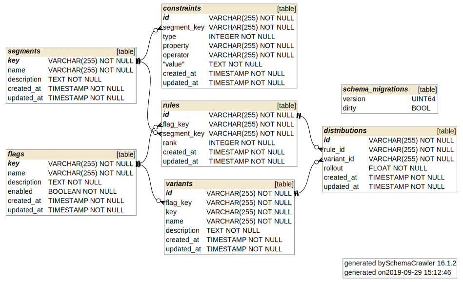

# Architecture

The overall Flipt server architecture is shown in this diagram:

!!! note
    Arrows indicate request or connection initiation direction, not necessarily dataflow direction.

As shown in the above diagram, the Flipt application is made up of three main components:

* Flipt Backend Service
* Flipt REST API
* Flipt Web UI

All three of these components run side by side in a single binary. The UI and REST API are served on the same port (`8080` by default) and the GRPC Backend Service is served on `9000` by default.

## Backend Service

The Flipt Backend Service is the main entrypoint to the application and implements all of the business logic for Flipt. This is what users of the gRPC client SDKs will communicate with, allowing for fast, efficient communication with your applications.

### REST API

The Flipt REST API is implemented on top of the Backend Service using gRPC Gateway (described below).

The REST API is served under `/api/v1` and allows all actions that the client SDKs allow.

### Web UI

The Flipt Web UI is a modern, minimalist UI to allow you to easily setup and monitor your feature flags and experiments. It's served as a JavaScript Single Page Application (SPA) and communicates with the Flipt Backend Service through the REST API.

A guide to using the UI for the first time can be found in the [Getting Started](getting_started.md) documentation.

## Database

Flipt can be run with either a SQLite or Postgres database. The [Configuration](configuration.md) documentation shows how to enable each database.

### Schema

## Technologies

Flipt is built using several amazing open source technologies including:

* [Go Programming Language](https://golang.org/)
* [gRPC](https://grpc.io/)
* [gRPC Gateway](https://github.com/grpc-ecosystem/grpc-gateway/)
* [Vue.js](https://vuejs.org/)
* [Bulma](https://bulma.io/)
* [Buefy](https://buefy.github.io/)

A brief description of why each technology was chosen is below.

### Go

From the [Go](https://golang.org/) documentation:

> Go makes it easy to build simple, reliable and efficient software.

These are all goals that Flipt also aspires to. Flipt was written in Go mainly because of it's ability to produce bulletproof systems software as as single binary for multiple architectures.

This allows Flipt to easily be deployed in almost any environment since it's as simple as copying a compiled binary.

### GRPC

[gRPC](https://grpc.io/) is a high performance, open source RPC framework created by Google. gRPC allows Flipt to be performant by eliminating much of the overhead incurred by using standard HTTP for communication.

gRPC also has the benefit of being able to generate client SDKs in many different languages from a single [Protobuf](https://github.com/markphelps/flipt/blob/master/rpc/flipt.proto) file.

This allows you easily integrate your services with Flipt regardless of the language they are written in.

### GRPC Gateway

While awesome, gRPC might not be for everyone. [gRPC Gateway](https://github.com/grpc-ecosystem/grpc-gateway/) is a reverse-proxy server which translates a RESTful JSON API into gRPC. This allows Flipt to implement a REST API as well as the gRPC API described above.

This means that the REST API follows the same codepaths as the gRPC service that Flipt implements, allowing for reduced bugs and a simpler architecture.

The Flipt UI is also built on top of the REST API provided by gRPC gateway.

### Vue.js

[Vue.js](https://vuejs.org/) is a minimal, modern and performant JavaScript framework that makes it easy to implement reactive frontend applications such as the Flipt UI. Vue.js was chosen because of it's rich ecosystem as well as ease of use to get started.

The Flipt UI is a Single Page Application (SPA) written in JavaScript using Vue.js, that communicates with with the Flipt backend over the Flipt REST API. This means that the UI uses the same API that end clients do, meaning that anything you can do with the Flipt API, you can do in the UI and vice versa.

### Bulma

[Bulma](https://bulma.io/) is a free, open source CSS framework based on Flexbox. It makes it easy to create nice looking user interfaces with minimal CSS.

### Buefy

[Buefy](https://buefy.github.io/) creates lightweight UI components for Vue.js based on Bulma. The Flipt UI was built using several Buefy components that greatly enhanced the speed of development.
