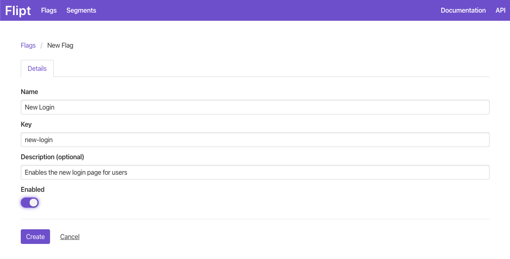
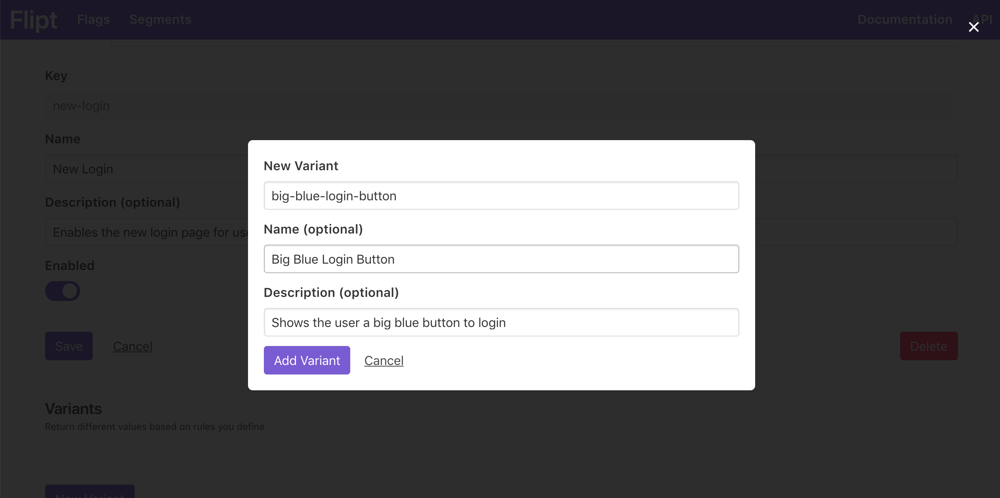
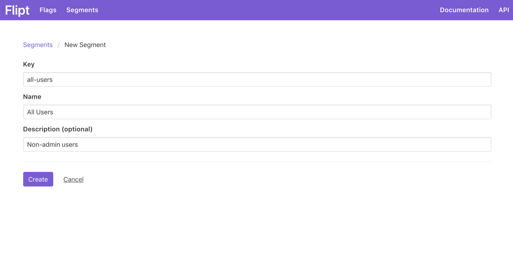
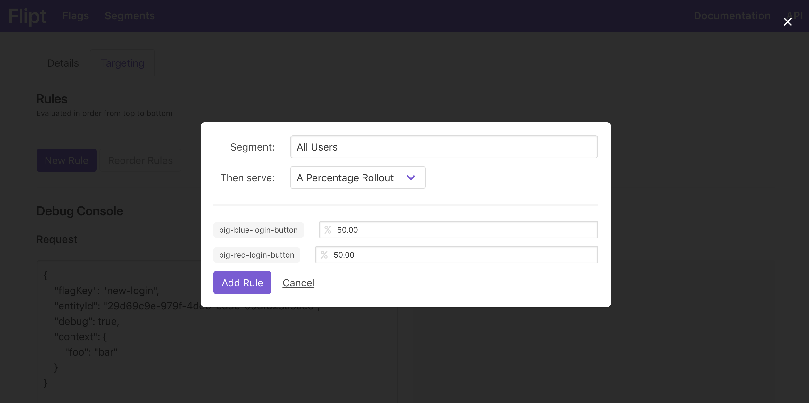
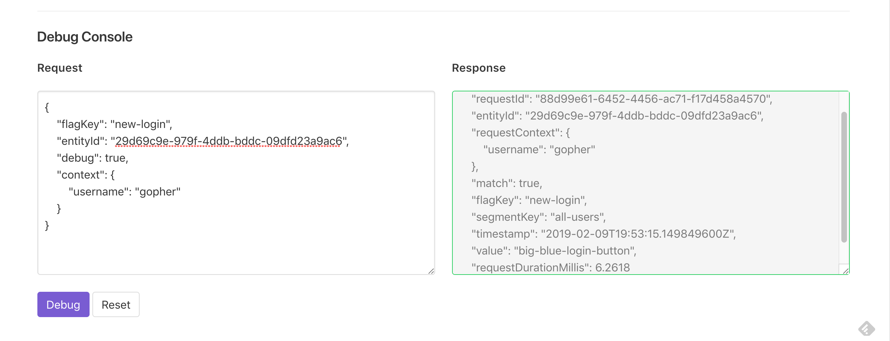

# Getting Started

This document describes how to get started with the Flipt UI.

Once you have your application integrated with the Flipt backend, it's time to create some flags to evaluate. This documentation will walk you through creating your first flag, segment, set of rules and finally using the debug console to evaluate everything.

For more information on any of the concepts described here, please see the [Concepts](concepts.md) documentation.

## Setup

Before getting started, make sure the Flipt server is up and running on your host on your chosen ports. See [Installation](installation.md) for more.

In this example we'll use the default location of [http://localhost:8080](http://localhost:8080).

## Creating a Flag and Variants

Now we'll create a flag and variants that we will use to evaluate against.

### Create a Flag

A flag is the basic entity in Flipt. Flags can represent features in your applications that you want to enable/disable for your users.

To create a flag:

1. Open the UI at [http://localhost:8080](http://localhost:8080).
1. Click `New Flag`.
1. Populate the details of the flag as shown.
1. Click `Enabled` so the flag will be enabled once created.
1. Click `Create`.

You should see the message `Flag created!`.

### Create Variants

Variants allow you to return different values for your flags based on rules that you define.

To create a variant:

1. On the Flag Details page for the new flag you created, click `New Variant`.
1. Populate the details of the variant as shown.
1. Click `Add Variant`.
1. Create one more variant populating the information as you wish.

You should see the message `Variant added!`.

Click `Flags` in the navigation menu and you should now see your newly created flag in the list.

## Creating a Segment and Constraints

Next we'll create a segment with a constraint that will be used to determine the reach of your flag.

### Create a Segment

Segments are used to split your userbase into subsets.

To create a segment:

1. From the main page click `Segments`.
1. Click `New Segment`.
1. Populate the details of the segment as shown.
1. Click `Create`.

You should see the message `Segment created!`.

### Create a Constraint

Constraints are used to target a specific segment.

!!! note
    Constraints are not required to match a segment. A segment with no constraints will match every
    request by default.

To create a constraint:

1. On the Segment Details page for the new segment you created, click `New Constraint`.
1. Populate the details of the constraint as shown.
1. Click `Add Constraint`.

You should see the message `Constraint added!`.

Click `Segments` in the navigation menu and you should now see your newly created segment in the list.

## Creating a Rule and Distributions

Finally we'll create a rule and set of distributions for your flag and variants. Rules and distributions allow you to define which variant gets returned when you evaluate a specific flag that falls into a given segment.

To create a rule and distribution:

1. Go back to the flag you created at the beginning.
1. Click `Targeting`.
1. Click `New Rule`.
1. Under `Segment:` choose the segment you created earlier.
1. Under `Then serve:` choose `A Percentage Rollout`.
1. You should see your two variants that you created earlier, with a percentage of 50% each next to them.
1. Click `Add Rule`.

You should see the message `Rule added!`. You just created your first rule and distribution.

A distribution is a way of assigning a percentage for which entities evaluated get a specific variant. The higher the percentage assigned, the more likely it is that any entity will get that specific variant.

!!! note
    You could just as easily have picked a single variant instead of `A Percentage Rollout` when setting up your rule. This would effectively mean you have a single distribution, a variant with 100% chance of being returned.

## Evaluating with the Debug Console

After creating the above flag, segment and targeting rule, you're now ready to test how this would work in your application.

Fortunately the Flipt UI contains a Debug Console to allow you to experiment with different evaluation requests to see how they would be evaluated.

The main ideas behind how evaluation works is described in more detail in the [Concepts](concepts.md) documentation.

To test evaluation:

1. Navigate to the `Targeting` section for your flag that you created above.
1. Scroll down to the `Debug Console` section and click into the left pane where you will see a JSON payload. This represents the body of the request that will be evaluated.
1. Notice the `flagKey` matches the `key` field of your flag.
1. Notice that `entityId` is prepopulated with a random UUID. This represents the ID that you would use to uniquely identify entities (ex: users) that you want to test against your flags.
1. Note that the `context` object is prepopulated as well. This corresponds to the properties that will be evaluated to determine if your request matches any constraints of your segments.
1. Update the `context` object as shown.
1. Click `Debug`.
1. Note the `Response` pane to the right has been populated with the evaluation response from the server, informing you that this request would match your segment that you created earlier, and return one of the variants defined.
1. Experiment with different values for the `context` and `entityId` fields.

!!! tip
    You can click `Reset` to populate a new example request in the `Request` pane. This will also generate a fresh UUID for the `entityId` field.

That's it! You're now ready to integrate Flipt into your application and start defining your own flags and segments that will enable you to seamlessly rollout new features to your users while reducing risk.
