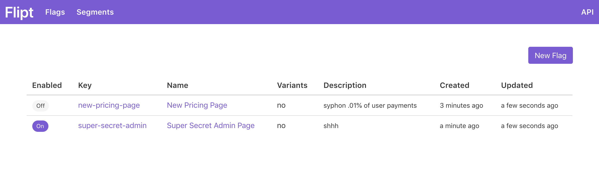

# Flipt

A self contained feature flag solution.

## What is Flipt

Flipt is an open source, self contained application that enables you to use feature flags and experiment (A/B test) across services, running in **your** environment.

This means that you can deploy Flipt within your existing infrastructure and not have to worry about your information being sent to a third party, or the latency required to communicate across the internet.

Flipt includes native client SDKs as well as a REST API so you can choose how to best integrate Flipt with your applications.

For more on Flipt and it's concepts, take a look at the [Concepts](concepts.md) documentation.

## Flipt Features

Flipt enables you to add [feature flag](https://martinfowler.com/bliki/FeatureToggle.html) support to your existing applications, with a simple, single UI and API.

This can range from simple on/off feature flags to more advanced use cases where you want to be able to rollout different versions of a feature to percentages of your users.

Flipt features include:

* Fast. Written in Go. Optimized for performance
* Stand alone, easy to run server with no external dependencies
* Ability to create advanced distribution rules to target segments of users
* Native GRPC client SDKs to integrate with your applications
* Simple REST API
* Modern UI and debug console

## Why Flipt

Many organizations understand the benefit of using feature flags in production, so they choose to implement them themselves in their main application or monolith.

As their organization grows, so does their infrastructure and functionality makes it's way into a multitude of other services. Many times those services aren't even implemented in the same language.

This is where their original feature flag solution tends to break down as it cannot be easily adapted to those services or languages. This results in:

1. Only being able to use feature flags in a subset of services.
1. Having multiple sources of truth for feature flags depending on the service/implementation leading to unpredictability.

Flipt solves all of these issues and more and enables you to focus on your applications, without having to worry about implementing your own feature flag solution that works across your infrastructure.

On top of this, Flipt provides a nice, modern UI so that you can always monitor the state of your feature flags and experiments in a single place.

## Running Flipt

Flipt is a single, self contained binary that you run on your own servers or cloud infrastructure. There are a multitude of benefits to running Flipt yourself, including:

* **Security**. No Flipt data leaves your servers and you don't have to open your systems to the outside world to communicate with Flipt. It all runs within your existing infrastructure.
* **Speed**. Since Flipt is co-located with your existing services, you do not have to communicate across the internet to another application running on the other side of the world which can add excessive latency and slow down your applications.
* **Simplicity**. Flipt is a single binary with no external dependencies. This means there is no database to manage or connect to, no clusters to configure, and data backup is as simple as copying a single file.

## What's Next

Want to get up and running with Flipt? See [Getting Started](getting_started).

For a more detailed guide on how to setup and run Flipt, checkout the [Installation](installation.md) documentation.

To learn how Flipt works, read up on it's [Architecture](architecture.md).

For more information on how to integrate Flipt with your existing applications, see the [Integration](integration.md) guide.

## Author

* Website: [Mark Phelps](https://markphelps.me)
* Twitter: [@mark_a_phelps](https://twitter.com/mark_a_phelps)
* Email: _mark.aaron.phelps at gmail.com_
