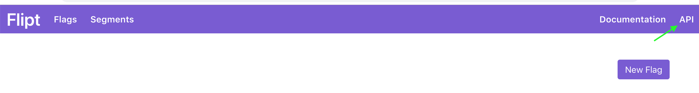
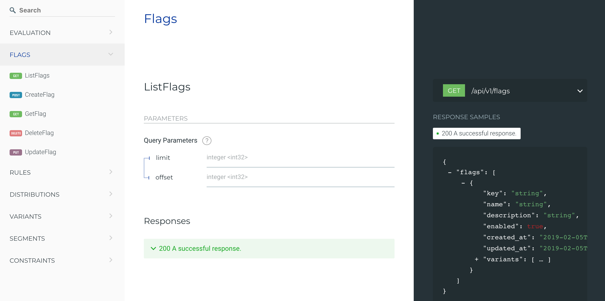

# Integration

This document describes how to integrate Flipt in your existing applications. To learn how to install and run Flipt, see the [Installation](installation.md) documentation.

Once you have the Flipt server up and running within your infrastructure, the next step is to integrate the Flipt client(s) with your applications that you would like to be able to use with Flipt.

There are two ways to communicate with the Flipt server:

1. GRPC
1. REST API

## Flipt Native GRPC Client

Since Flipt is a [GRPC](https://grpc.io/) enabled application (see: [Architecture](architecture.md)), to communicate with the Flipt server, you can use a generated GRPC client for your language of choice.

This means that your application can use the Flipt GRPC client if it is written in one of the many languages that GRPC supports, including:

* C++
* Java
* Python
* Go
* Ruby
* C#
* Node.js
* Android Java
* Objective-C
* PHP

The Flipt GRPC client is the preferred way to integrate your application with Flipt as it is more performant than REST and requires the least amount of configuration.

An example Go application exists at [https://github.com/markphelps/flipt/examples/basic](https://github.com/markphelps/flipt/tree/master/examples/basic), showing how you would integrate with Flipt using the Go GRPC client.

### Getting the Flipt GRPC clients

#### Download

Flipt GRPC clients are currently available for the following languages:

* Go: [https://github.com/markphelps/flipt-grpc-go](https://github.com/markphelps/flipt-grpc-go)

If your language is not listed, please see the section below on how to generate a native GRPC client manually. If you choose to open source this client, please submit a pull request so I can add it to the docs.

#### Manually

If a GRPC client in your language is not available for download, you can easily generate it yourself using the existing [protobuf definition](https://github.com/markphelps/flipt/blob/master/proto/flipt.proto). The [GRPC documentation](https://grpc.io/docs/) has extensive examples on how to generate GRPC clients in each supported language.

!!! note
    GRPC generates both client implementation and the server interfaces. To use Flipt you only need the GRPC client implementation and can ignore the server code as this is implemented by Flipt itself.

## Flipt REST API

Flipt also comes equipped with a fully functional REST API. In fact, the Flipt UI is completely backed by this same API. This means that anything that can be done in the Flipt UI can also be done via the REST API.

The Flipt REST API can also be used with any language that can make HTTP requests. This means that you don't need to use one of the above GRPC clients in order to integrate your application with Flipt.

The latest version of the REST API is fully documented using OpenAPI v2 (formerly Swagger) specification available [here](https://github.com/markphelps/flipt/blob/master/swagger/api/swagger.json).

Each Flipt server instance also hosts it's own REST API documentation. This documentation is reachable in the Flipt UI by clicking the **API** link in the header navigation.

This will load the API documentation which documents valid requests/responses to the Flipt REST API:

## Third-Party Client Libraries

Client libraries built by awesome people from the Open Source community:

* [Flipt-iOS-SDK](https://github.com/Camji55/Flipt-iOS-SDK)
