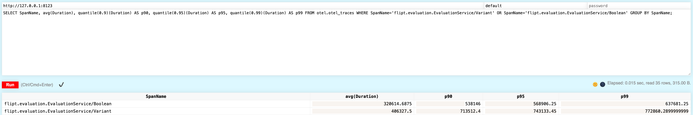

# Analytics

The examples contained within this directory show different ways to gather useful analytical data concerning Flipt.

## Clickhouse

[Clickhouse](https://clickhouse.com/) has Alpha support as a destination for traces collected by an OpenTelemetry collector as stated in their [documentation](https://github.com/open-telemetry/opentelemetry-collector-contrib/blob/main/exporter/clickhouseexporter/README.md).

To perform a clean installation of Clickhouse, we separated the example into the `clickhouse` subdirectory.

The configuration for the OpenTelemetry collector should look familiar if you have followed the above examples, and this [yaml](./clickhouse/otel-collector-config.yaml) could serve as a base to fit your configuration needs.

### Data



Once you run the `docker-compose`, you can start creating flags, making evaluations, etc. After data is collected in the Clickhouse server, you can connect to the server via web UI at `http://localhost:8123/play`. From here you can glean powerful analytical data such as average and quantile measurements from the flag evaluations.

```sql
SELECT SpanName, avg(Duration), quantile(0.9)(Duration) AS p90, quantile(0.95)(Duration) AS p95, quantile(0.99)(Duration) AS p99 FROM otel.otel_traces WHERE SpanName='flipt.evaluation.EvaluationService/Variant' OR SpanName='flipt.evaluation.EvaluationService/Boolean' GROUP BY SpanName;
```

This query will return average and quantile results (p90, p95, p99) for `Variant` and `Boolean` evaluations.

Queries against metrics tables could provide additional information about evaluations over time. For example:

```sql
SELECT Attributes['namespace'] as namespaceKey, Attributes['flag'] as flagKey, toStartOfHour(TimeUnix) as StartOfHour, avg(Value) as Value
FROM otel.otel_metrics_sum
WHERE MetricName = 'flipt_evaluations_requests_total'
GROUP BY namespaceKey, flagKey, StartOfHour
ORDER BY StartOfHour;
```

 To perform more insightful queries, see the [Clickhouse SQL reference documentation](https://clickhouse.com/docs/en/sql-reference).
