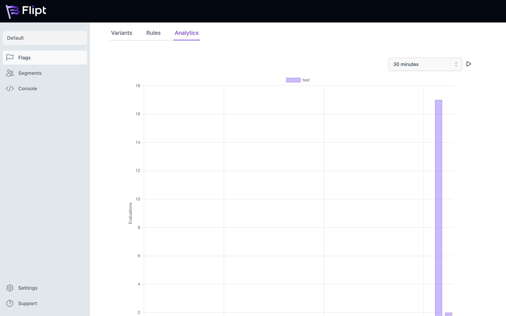

    

# ClickHouse Example

Flipt supports storing and querying flag evaluation data by leveraging [ClickHouse](https://clickhouse.com/) as the backend data store. 

This example demonstrates how to use Flipt with ClickHouse to store and query flag evaluation data.

## Requirements

To run this example application you'll need:

* [Docker](https://docs.docker.com/install/)
* [docker-compose](https://docs.docker.com/compose/install/)

## Running the Example

1. Run `docker-compose up` from this directory
1. Open the Flipt UI (default: [http://localhost:8080](http://localhost:8080))
1. Create some sample data: Flags/Segments/etc. Perform a few evaluations in the Console.
1. Navigate to the `Analytics` tab for the flag that you created and evaluated.
