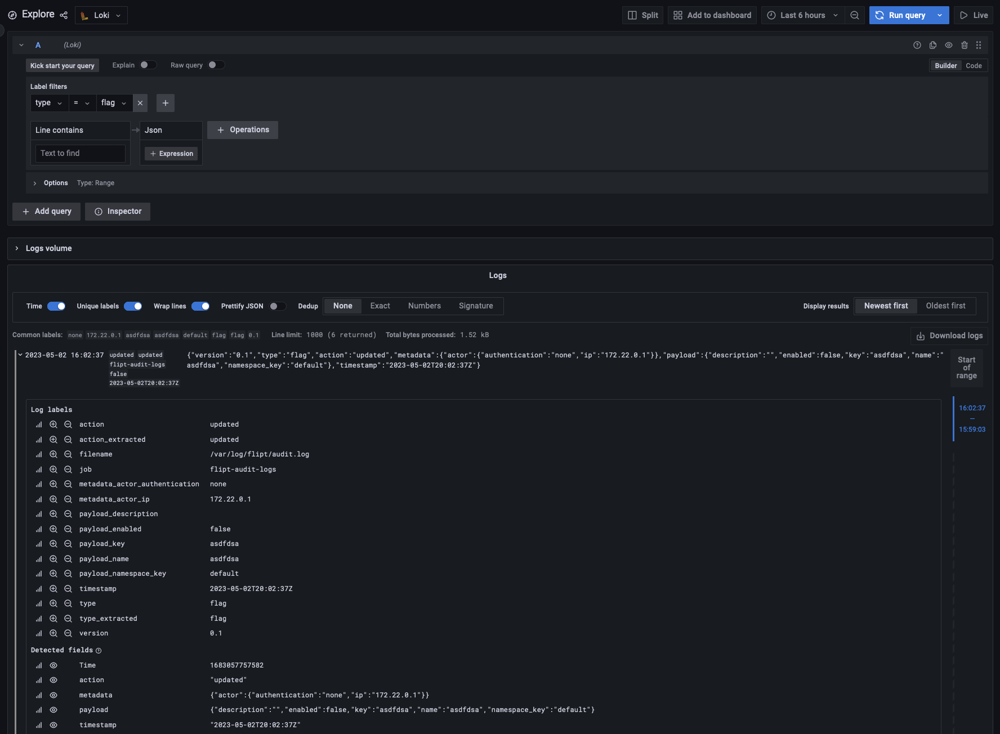

<p align="center">
    
</p>

# Audit Event Logging / Grafana Loki Example

This example shows how you can run Flipt with audit event logging enabled to a file using the `log` audit sink.

This works by setting the two environment variables `FLIPT_AUDIT_SINKS_LOG_ENABLED` and `FLIPT_AUDIT_SINKS_LOG_FILE`:

**Note**: Support for audit events were added in [v1.21.0](https://github.com/flipt-io/flipt/releases/tag/v1.21.0) of Flipt.

```bash
FLIPT_AUDIT_SINKS_LOG_ENABLED=true
FLIPT_AUDIT_SINKS_LOG_FILE=/var/log/flipt/audit.log
```

The auditable events currently are `created`, `updated`, and `deleted` operations on `flags`, `variants`, `segments`, `constraints`, `rules`, `distributions`, `namespaces`, and `tokens`. If you do any of these operations through the API, Flipt will emit an audit event log to the specified location.

In this example, we are using Grafana's [Loki](https://grafana.com/docs/loki/latest/) to scrape, aggregate, and label the audit logs on the container and index them for searching via the Grafana/Loki integration. 

## Requirements

To run this example application you'll need:

* [Docker](https://docs.docker.com/install/)
* [docker-compose](https://docs.docker.com/compose/install/)

## Running the Example

1. Run `docker-compose up` from this directory
1. Open the Flipt UI (default: [http://localhost:8080](http://localhost:8080))
1. Create some sample data: Flags/Segments/etc.
1. Open the Grafana Explore UI (default: [http://localhost:3000/explore](http://localhost:3000/explore))
1. Enter a sample query in the 'code' input, ex: `{type="flag"} |= `` | json` and click 'Run Query'.
1. You should see a table of audit events for flags. You can change the `type` label to `segment`, `variant`, etc. to see other types of audit events and also change the `action` label as well to filter on event actions such as `created`, `updated`, and `deleted`.
1. The Loki docs have more information on how to query and filter the logs: [https://grafana.com/docs/loki/latest/logql/](https://grafana.com/docs/loki/latest/logql/)


