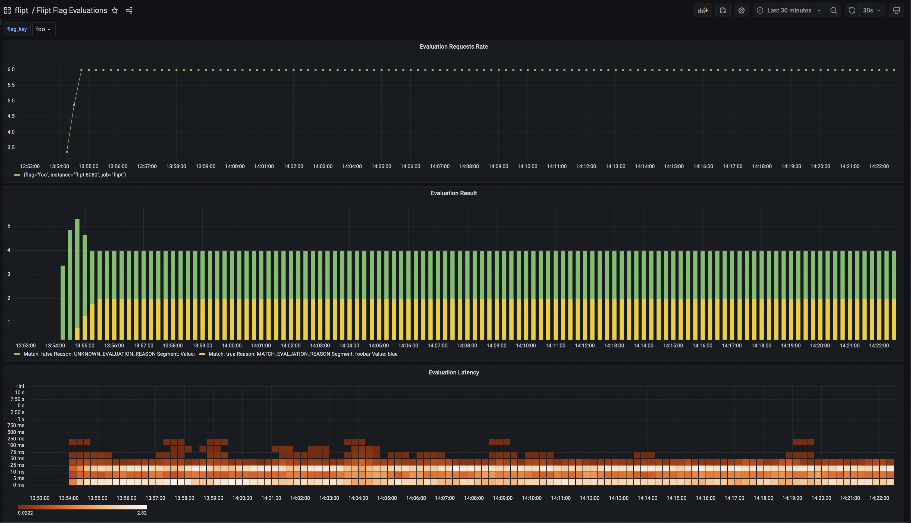

    
    

# Metrics Example

This example shows how you can run Flipt with a Prometheus for metrics and Grafana for visualization.

## Requirements

To run this example application you'll need:

* [Docker](https://docs.docker.com/install/)
* [docker-compose](https://docs.docker.com/compose/install/)

## Running the Example

1. Run `docker-compose up` from this directory
1. Open the Flipt UI (default: [http://localhost:8080](http://localhost:8080))
1. Create some sample data: Flags/Segments/etc.
1. Open the Prometheus UI (default: [http://localhost:9090/graph](http://localhost:9090/graph))
1. Enter a sample query in the query input, ex: `grpc_server_handled_total{grpc_method="ListFlags"}` and press 'Execute'
1. You should see a graph of requests to `ListFlags`
1. Open the Grafana UI (default: [http://localhost:3000](http://localhost:3000))
1. Create a new dashboard (or import from our [grafana-dashboards](https://github.com/flipt-io/grafana-dashboards) repository)
