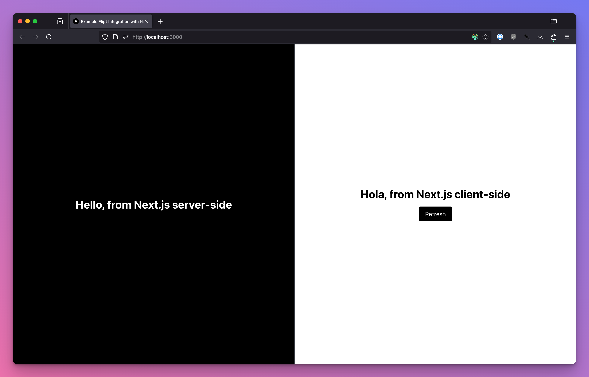

# NextJS Example

This is an example of how to use Flipt with a NextJS application.

**Note:** This example is not meant to be used in production, it is only meant to demonstrate how to use Flipt with NextJS.

It uses both the [Flipt Node SDK](https://github.com/flipt-io/flipt-client-sdks/tree/main/flipt-client-node) and [Flipt React SDK](https://github.com/flipt-io/flipt-client-sdks/tree/main/flipt-client-react) to evalute feature flags from the Flipt API in two different ways:

1. Using the [`getServerSideProps`](https://nextjs.org/docs/basic-features/data-fetching/get-server-side-props) function to evaluate the flags on the server side before rendering the page
1. Using the Flipt React SDK to evaluate the flags in the browser/client side

We also included [some code](./pages/api/hello.ts) showing how you could use Flipt with [NextJS API routes](https://nextjs.org/docs/api-routes/introduction), but we are not hitting the API it in this example.

## Example

In this example, we are leveraging Flipt to prototype some personalization for our NextJS application. We want to show a different greeting message to the user at random, but we aren't sure if we should use client-side data fetching or server-side data fetching, so we are going to try both ways. We will use both the Flipt Node SDK and Flipt Browser SDK to integrate with Flipt.

## Architecture

Both examples are using the same Flipt flag and are evaluating the flag within the application. Both of these SDKs pull flag state from the Flipt server and perform evaluation client-side in the browser or server-side (Node.js) in the application.

### Client Side

For the client-side example, we are using the [Flipt React SDK](https://github.com/flipt-io/flipt-client-sdks/tree/main/flipt-client-react) to evaluate the flag in the browser/client side. The `FliptEvaluationClient` object pulls flag state from the Flipt server and performs evaluation client-side in the browser to evalute the `language` flag.

### Server Side

For the server-side example, we are using the [`getServerSideProps`](https://nextjs.org/docs/basic-features/data-fetching/get-server-side-props) function to evaluate the flags on the server side before rendering the page. This uses the `FliptEvaluationClient` to evalute the `language` flag to then render the greeting message. While this example is using the same flag as the client-side example, it is important to note that the Flipt Node SDK is running on the server-side and is not sending any data to the browser.

## Requirements

To run this example application you'll need:

- [Docker](https://docs.docker.com/install/)
- [docker-compose](https://docs.docker.com/compose/install/)

## Running the Example

1. Run `docker-compose up` from this directory
1. Open the Flipt UI (default: [http://localhost:8080](http://localhost:8080)) to browse the example Flags/Variants/Segments/etc that are pre-populated.
1. Open the NextJS UI (default: [http://localhost:3000](http://localhost:3000)) to see the example application.
1. Refresh the page to see the greeting messages change.

    

