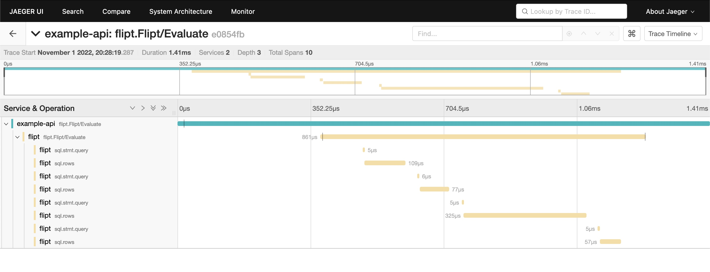
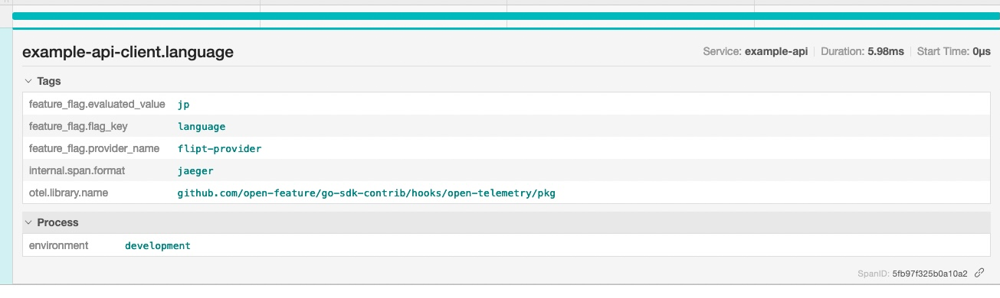

    

# OpenFeature/OpenTelemetry Example

This example shows how you can run Flipt, Jaeger and an example REST API which integrates with Flipt using the [Flipt OpenFeature Provider](https://github.com/flipt-io/flipt-openfeature-provider-go) + [OpenFeature Client SDK](https://github.com/open-feature/go-sdk) + [OpenTelemetry hook](https://github.com/open-feature/go-sdk-contrib/tree/main/hooks/open-telemetry).

## Example

In this example, we are leveraging Flipt to prototype a new REST API endpoint for our application. This endpoint will be used to return a greeting message to the user based on some value. We will use the OpenFeature Go SDK to integrate with Flipt and the OpenTelemetry hook to send tracing data to Jaeger.

Since this is just a prototype, we will deterministically return a greeting message based on the value of `user` query param in the request. We support 5 languages: English, Spanish, French, Japanese and German, each with a 20% chance of being returned.

Note: The same language will always be returned for the same value of `user` query param. If no value is present one will be generated at random.

## Requirements

To run this example application you'll need:

* [Docker](https://docs.docker.com/install/)
* [docker-compose](https://docs.docker.com/compose/install/)

## Running the Example

1. Run `docker-compose up` from this directory
1. Open the Flipt UI (default: [http://localhost:8080](http://localhost:8080)) to browse the example Flags/Variants/Segments/etc that are pre-populated.
1. Open the Jaeger UI (default: [http://localhost:16686](http://localhost:16686))
1. Run `curl http://localhost:8000/api/greeting?user=xyz` a few times with different values for `user` to generate some data
1. Select 'flipt' from the Service dropdown
1. Click 'Find Traces'
1. You should see a list of server traces to explore
1. Select 'example-api' from the Service dropdown
1. Click 'Find Traces'
1. You should see a list of client traces to explore that show the client request and response back from Flipt.

Note that the OpenFeature SDK added some additional tags to the span, including:

* `feature_flag.evaluated_value` - the value of the evaluated feature flag
* `feature_flag.flag_key` - the key of the evaluated feature flag
* `feature_flag.provider_name` - the name of the provider that evaluated the feature flag (Flipt in this case)
