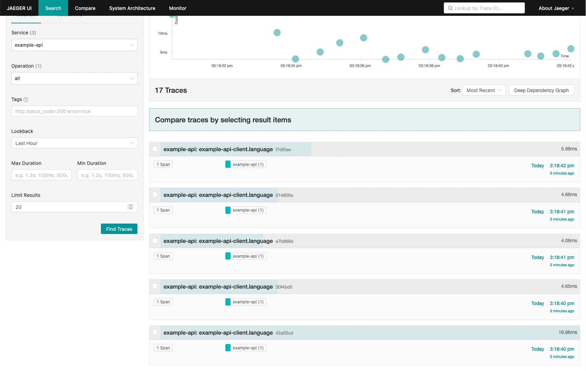
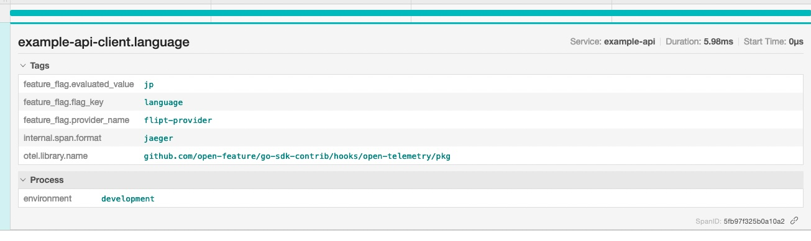

    

# OpenFeature/OpenTelemetry Example

This example shows how you can run Flipt, Jaeger and a example REST API which integrates with Flipt using the [Flipt OpenFeature Provider](https://github.com/flipt-io/flipt-openfeature-provider-go) + [OpenFeature Client SDK](https://github.com/open-feature/go-sdk) + [OpenTelemetry hook](https://github.com/open-feature/go-sdk-contrib/tree/main/hooks/open-telemetry).

## Example

This example pretends that we have a simple REST API that returns some information about our users such as their prefered language. We want to be able to leverage Flipt to return this data. For this simple example, the language will be returned somewhat randomly based on the requestID to our API.

We support 4 languages: English, Spanish, Japanese and German, each with a 25% chance of being returned for a given requestID.

This example also shows how to use the OpenTelemetry hook to trace the request through the Flipt OpenFeature Provider and OpenFeature Client SDK, so that we can see the request in Jaeger from the client to the server.

## Requirements

To run this example application you'll need:

* [Docker](https://docs.docker.com/install/)
* [docker-compose](https://docs.docker.com/compose/install/)

## Running the Example

1. Run `docker-compose up` from this directory
1. Open the Flipt UI (default: [http://localhost:8080](http://localhost:8080)) to browse the example Flags/Variants/Segments/etc that are pre-populated.
1. Open the Jaeger UI (default: [http://localhost:16686](http://localhost:16686))
1. Run `curl http://localhost:8000/api` a few times to generate some data
1. Select 'flipt' from the Service dropdown
1. Click 'Find Traces'
1. You should see a list of server traces to explore
1. Select 'example-api' from the Service dropdown
1. Click 'Find Traces'
1. You should see a list of client traces to explore which show the client request and response back from Flipt.

Note that the OpenFeature SDK added some additional tags to the span, including:

* `feature_flag.evaluated_value` - the value of the evaluated feature flag
* `feature_flag.flag_key` - the key of the evaluated feature flag
* `feature_flag.provider_name` - the name of the provider that evaluated the feature flag (Flipt in this case)
