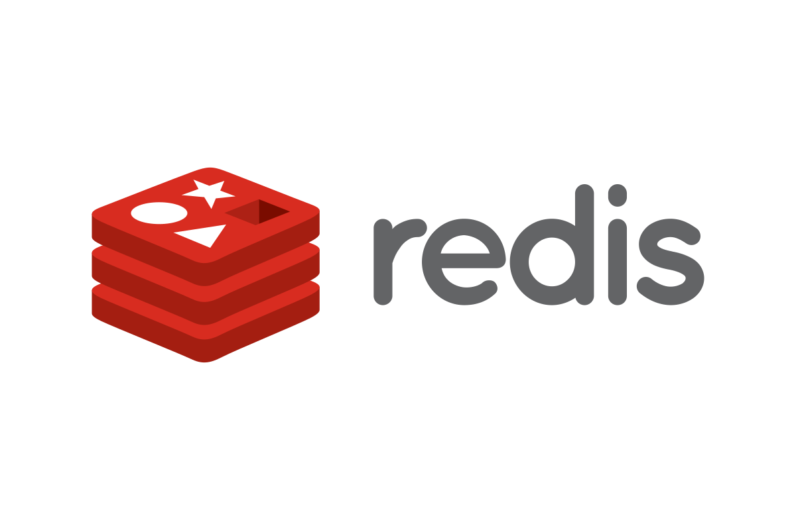

<p align="center">
    
</p>

# Redis Example

This example shows how you can run Flipt with a Redis cache for caching flags and evaluation responses.

This works by setting the following environment variables to configure Redis in the container:

```bash
FLIPT_CACHE_ENABLED=true
FLIPT_CACHE_TTL=60s
FLIPT_CACHE_BACKEND=redis
FLIPT_CACHE_REDIS_HOST=redis
FLIPT_CACHE_REDIS_PORT=6379
```

For more information on how to use Redis with Flipt, see the [Flipt caching documentation](https://flipt.io/docs/configuration#caching).

## Requirements

To run this example application you'll need:

* [Docker](https://docs.docker.com/install/)
* [docker-compose](https://docs.docker.com/compose/install/)

## Running the Example

1. Run `docker-compose up` from this directory
1. Open the Flipt UI (default: [http://localhost:8080](http://localhost:8080))
1. Check the logs to see that the Redis cache is enabled:

    ```console
    level=debug msg="cache: \"redis\" enabled" server=grpc
    ```
