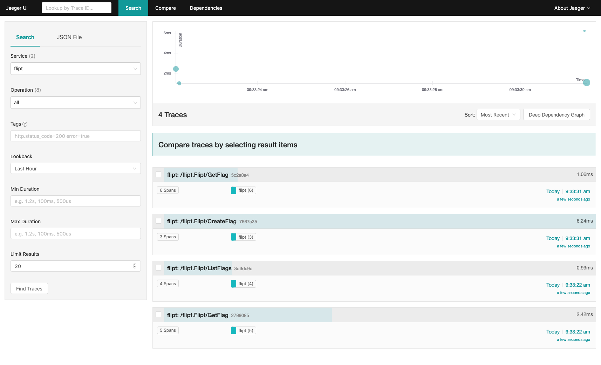

# Tracing Example

This example shows how you can run Flipt with a Jaeger/Open Tracing sidecar application in Docker.

## Requirements

To run this example application you'll need:

* [Docker](https://docs.docker.com/install/)
* [docker-compose](https://docs.docker.com/compose/install/)

## Running the Example

1. Run `docker-compose up` from this directory
1. Open the Flipt UI (default: [http://localhost:8080](http://localhost:8080))
1. Create some sample data: Flags/Segments/etc.
1. Open the Jaeger UI (default: [http://localhost:16686](http://localhost:16686))
1. Select 'flipt' from the Service dropdown
1. Click 'Find Traces'
1. You should see a list of traces to explore
