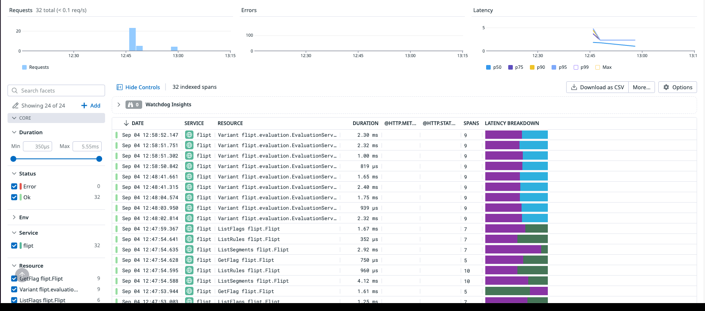

# OTLP Example

This example shows how you can run Flipt with an [OpenTelemetry Protocol](https://opentelemetry.io/docs/reference/specification/protocol/) exporter which recieves, aggregates, and in-turn exports traces to both Jaeger and Zipken backends.

## Requirements

To run this example application you'll need:

* [Docker](https://docs.docker.com/install/)
* [docker-compose](https://docs.docker.com/compose/install/)

## Running the Example

1. Run `docker-compose up` from this directory
1. Open the Flipt UI (default: [http://localhost:8080](http://localhost:8080))
1. Create some sample data: Flags/Segments/etc. Perform a few evaluations in the Console.

### Jaeger UI


1. Open the Jaeger UI (default: [http://localhost:16686](http://localhost:16686))
1. Select 'flipt' from the Service dropdown
1. Click 'Find Traces'
1. You should see a list of traces to explore

### Zipkin UI


1. Open the Zipkin UI (default: [http://localhost:9411](http://localhost:9411))
1. Select `serviceName=flipt` from the search box
1. Click 'Run Query'
1. You should see a list of traces to explore

### Datadog UI



For exporting traces from [OpenTelemetry to Datadog](https://docs.datadoghq.com/opentelemetry/otel_collector_datadog_exporter) you have to configure the exporter in the `otel-collector-config.yaml`:

```yaml
exporters:
  datadog:
    api:
      site: datadoghq.com
      key: ${DD_API_KEY}
```

**Note:** The `DD_API_KEY` should be replaced with your actual api key from Datadog.

Furthermore, you also have to add `datadog` as an entry in `exporters` under `service.pipelines.traces.exporters`.

For example:

```yaml
service:
  extensions: [pprof, zpages, health_check]
  pipelines:
    traces:
      receivers: [otlp]
      processors: [batch]
      exporters: [logging, zipkin, jaeger, datadog]
```

1. Open the Datadog traces UI under the menu item on the left `APM` then `Traces`
1. You should see a list of traces to explore
