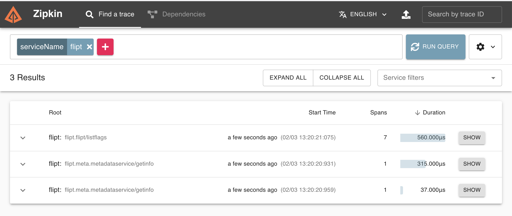

# Zipkin Example

This example shows how you can run Flipt with a Zipkin application in Docker.

## Requirements

To run this example application you'll need:

* [Docker](https://docs.docker.com/install/)
* [docker-compose](https://docs.docker.com/compose/install/)

## Running the Example

1. Run `docker-compose up` from this directory
1. Open the Flipt UI (default: [http://localhost:8080](http://localhost:8080))
1. Create some sample data: Flags/Segments/etc. Perform a few evaluations in the Console.
1. Open the Zipkin UI (default: [http://localhost:9411](http://localhost:9411))
1. Select `serviceName=flipt` from the search box
1. Click 'Run Query'
1. You should see a list of traces to explore
